# Chapter 1 – A Dialogue on the Book  


## Why “Three Easy Pieces”?  
- The authors narrowed OS into **three central ideas (pieces):**
  1. **Virtualization**  
     - Abstracting and managing physical resources (e.g., CPU, memory, devices).  
     - Examples: virtual memory, CPU scheduling, virtual machines.  
  2. **Concurrency**  
     - Managing multiple tasks at the same time.  
     - Ensures safe and efficient sharing of resources among processes and threads.  
     - Core problems: synchronization, deadlocks, race conditions.  
  3. **Persistence**  
     - Ensuring data survives even after power loss or system crashes.  
     - Topics: file systems, storage devices, data consistency, recovery.  

---
✦━━━━━━━━━━━━━━━✦
   End of Chapter
✦━━━━━━━━━━━━━━━✦
---


# Chapter 2: Introduction to Operating Systems

This chapter introduces the fundamental concepts and functions of an operating system (OS). It highlights the core problems an OS solves and the key design goals that guide its development.

---

## What is an Operating System?

* An **operating system (OS)** is a body of software responsible for making a computer system easy to use.
* It manages **physical resources** like the processor (CPU), memory (DRAM), and storage (disk).
* The OS provides **abstractions** to make these resources more general, powerful, and user-friendly.

---

## The Core Functions of an OS

The OS performs three primary functions, often referred to as a **virtual machine**, **standard library**, and **resource manager**.

### 1. Virtualization

* The OS creates the **illusion** that each program has its own private, dedicated resources, even though they are shared.
* This process is called **virtualization**.
* **Virtualizing the CPU**: The OS makes a single CPU appear as if there are many **virtual CPUs**, allowing multiple programs to run seemingly at the same time. This is achieved by rapidly switching between programs.
* **Virtualizing Memory**: The OS gives each program its own **private virtual address space**, even though they share the same physical memory. This prevents one program from interfering with another's data.

### 2. Concurrency

* This refers to the challenges that arise when multiple tasks (like threads) run at the same time within the same program.
* A key problem is **race conditions**, where the final outcome depends on the unpredictable order of operations.
* The OS provides primitives and mechanisms to help programmers build **correct concurrent programs** by managing shared resources and ensuring **atomic** operations.

### 3. Persistence

* **Persistence** is the ability to store data reliably and long-term, even if the power goes off or the system crashes.
* The OS manages **input/output (I/O) devices** like hard drives and SSDs, which are used for persistent storage.
* The **file system** is the part of the OS responsible for managing files and directories, ensuring data is stored reliably and efficiently on these devices. Unlike virtualization, files are often shared between applications.
* The OS acts as a **standard library** by providing a set of system calls (APIs) for applications to interact with devices and other resources, abstracting away the complex, low-level details.

---

## Design Goals of an OS

* **Abstractions**: Providing a higher-level, simpler interface to complex hardware.
* **High Performance**: Minimizing the **overheads** (extra time and space) introduced by the OS to ensure efficient operation.
* **Protection**: Ensuring that one application's malicious or accidental behavior doesn't harm other applications or the OS itself. This is achieved through **isolation**.
* **Reliability**: Building a robust system that can handle failures and recover gracefully, as a system crash affects all running applications.

---

## Summary

The OS is a crucial piece of software that virtualizes resources, manages concurrency, and provides persistent storage. It achieves these goals while striving for high performance, reliability, and security. The core of an OS lies in finding the right **trade-offs** between these competing goals.

---
✦━━━━━━━━━━━━━━━✦
   End of Chapter
✦━━━━━━━━━━━━━━━✦
---

# Chapter 3 – A Dialogue on Virtualization

##  Introduction to Virtualization
- Virtualization is one of the **three central pieces** of Operating Systems (along with Concurrency and Persistence).
- Core idea: **Create the illusion of multiple independent resources from a single physical resource.**
- Analogy used: **The Peach Analogy**
  - **Physical peach** → the real resource (e.g., CPU).
  - **Virtual peaches** → illusions given to many users, making each think they have their own.
  - In reality, there’s still **only one physical peach**, but the illusion is convincing.

---
✦━━━━━━━━━━━━━━━✦
   End of Chapter
✦━━━━━━━━━━━━━━━✦
---

# Chapter 4: The Abstraction: The Process
In this chapter, we discuss one of the most fundamental abstractions that the OS provides to users: the **process**. The definition of a process, informally, is quite simple: it is a running program 
This chapter also explains how the OS creates the illusion of multiple CPUs. It discusses the components of a process, its life cycle, and the data structures used to manage it.

---

## The Abstraction: A Process

* A **process** is a running program. A program is a static set of instructions on disk, but a process is a dynamic, active instance of that program.
* The OS **virtualizes the CPU** through **time sharing**, switching between different processes to create the illusion that they are all running simultaneously on a single CPU.
* **Mechanisms** are low-level machinery that implement OS functionality (e.g., a **context switch**).Mechanisms are low-level methods or protocols that implement a needed piece of functionality.On top of these mechanisms resides some of the intelligence in the
OS, in the form of policies.
* **Policies** are high-level algorithms that make decisions (e.g., a **scheduling policy** decides which process to run next). A good OS design separates policy from mechanism.

### TIP: USE TIME SHARING (AND SPACE SHARING)
**Time sharing** is one of the most basic techniques used by an OS to share a resource. By allowing the resource to be used for a little while by one entity, and then a little while by another, and so forth, the resource in question (e.g., the CPU, or a network link) can be shared by many. The natural counterpart of time sharing is **space sharing**, where a resource is divided (in space) among those who wish to use it. For example, disk space is naturally a space-shared resource, as once a block is assigned to a file, it is not likely to be assigned to another file until the user deletes it.

### What Constitutes a Process?

A process is characterised by its **machine state**, which includes:

* **Memory (Address Space)**: This holds the program's code, static data, heap, and stack.
* **Registers**: These include general-purpose registers and special registers like the **program counter (PC)**, which points to the next instruction to execute, and the **stack pointer (SP)**.
* **Persistent Storage**: Information related to I/O, such as a list of currently open files.

---

## Process API

The OS provides an **Application Programming Interface (API)** for managing processes. Key functions include:

* **Create**: To load a program and create a new process instance.
* **Destroy**: To forcefully terminate a process.
* **Wait**: To pause and wait for another process to finish.
* **Miscellaneous Control**: To suspend or resume a process.
* **Status**: To get information about a process.

### Process Creation in Detail

The OS transforms a program into a process through these steps:
1.  **Loading**: The OS reads the program's code and static data from disk into the process's memory. This can be done eagerly (all at once) or lazily (as needed).
2.  **Stack Initialization**: A stack is created and initialized for local variables, function parameters, and return addresses. The OS also passes command-line arguments (argc, argv) to the main() function.
3.  **Heap Allocation**: A small heap is allocated for dynamic data. The heap can grow as the program requests more memory.
4.  **I/O Setup**: File descriptors for standard input, output, and error are set up.
5.  **Execution**: The OS jumps to the program's entry point (e.g., main()), transferring control to the new process.

---

## Process States

A process can be in one of three simplified states:
* **Running**: The process is currently executing instructions on the CPU.
* **Ready**: The process is ready to run but is waiting for the OS to schedule it.
* **Blocked**: The process is waiting for an event to complete (e.g., I/O operation) and is not ready to run.
* **Scheduled**: The OS moves a process from the **ready** state to the **running** state.
* **Descheduled**: The OS moves a process from the **running** state to the **ready** state.

---

## Data Structures

The OS uses a **process list** to keep track of all processes. Each entry in the list is often called a **Process Control Block (PCB)** and contains vital information about the process.

Key information tracked in a PCB:
* **Process State**: The current state of the process (e.g., Running, Ready, Blocked).
* **Process ID (PID)**: A unique identifier for the process.
* **Register Context**: Saved values of the process's registers, which are stored when the process is not running. This allows the OS to resume the process correctly later.
* **Other Information**: Parent process, open files, current working directory, etc.

Some systems also have additional states like **"Embryo"** (during creation) and **"Zombie"** (exited but not yet cleaned up by its parent process).

---
✦━━━━━━━━━━━━━━━✦
   End of Chapter
✦━━━━━━━━━━━━━━━✦
---

# Chapter 5: Interlude: Process API

This chapter focuses on the core UNIX system calls for managing processes: `fork()`, `exec()`, and `wait()`. These APIs are foundational to how modern shells and other programs create and control processes.

---

## 1. The `fork()` System Call

* The `fork()` system call creates a new process, known as the **child process**, as an almost identical copy of the calling process, known as the **parent process**.
* The parent and child processes are nearly identical, with their own private copies of the memory, registers, and other machine state.
* The only key difference is the value returned by `fork()`:
    * The **parent** receives the **Process ID (PID)** of the newly created child.
    * The **child** receives a return value of **0**.
* This design allows developers to write code that behaves differently in the parent and child processes.
* The output of a program that calls `fork()` is **non-deterministic** because the OS scheduler can run either the parent or the child first.

---

## 2. The `wait()` System Call

* The `wait()` system call is used by a parent process to **pause its execution** and wait for a child process to finish.
* When a child process exits, the `wait()` call in the parent returns.
* This system call can be used to make the execution flow **deterministic**, as the parent will not proceed until the child is complete.

---

## 3. The `exec()` System Call

* The `exec()` family of system calls (e.g., `execvp()`) loads a new program into the current process's memory space and begins executing it.
* A key point is that `exec()` **does not create a new process**. Instead, it **replaces** the current process's code, static data, heap, and stack with those of the new program.
* A successful call to `exec()` never returns, because the original program is overwritten.

---

## The `fork()` and `exec()` Combination

* The separation of `fork()` and `exec()` is a powerful design choice in UNIX.
* It allows a program, like a **shell**, to perform tasks **between** creating a child process and executing a new program.
* This intermediate stage is crucial for implementing features like **I/O redirection** and **pipes**.

### Example: I/O Redirection

* When you use a command like `wc p3.c > newfile.txt`, the shell works as follows:
    1.  The shell calls `fork()` to create a child process.
    2.  The child process closes its standard output file descriptor.
    3.  The child opens a new file, `newfile.txt`. The OS assigns this new file descriptor a low number, which often becomes the new standard output.
    4.  The child calls `exec()` to run the `wc` program.
    5.  The `wc` program, now running in the child process, writes its output to standard output, which is now redirected to `newfile.txt`.
    6.  The parent process calls `wait()` to wait for the child to finish.
* This same principle applies to **pipes** (`|`), which redirect the standard output of one process to the standard input of another via an in-kernel queue.

---

## Other Process APIs

* **`kill()`**: A system call used to send a signal to a process, such as to terminate or suspend it.
* **`ps` and `top`**: Command-line tools that provide information about the processes currently running on the system, their resource usage, and their state.

---
✦━━━━━━━━━━━━━━━✦
   End of Chapter
✦━━━━━━━━━━━━━━━✦
---

# Chapter 6: Mechanism: Limited Direct Execution

This chapter explains how the OS virtualizes the CPU using **Limited Direct Execution**, a technique that balances high performance with OS control.

---

## The Challenge of CPU Virtualization

To virtualize the CPU, the OS must share a single physical CPU among many processes. This requires solving two key problems:
* **Performance**: How to implement virtualization efficiently without adding excessive overhead.
* **Control**: How to ensure the OS retains control over the CPU to prevent a single process from taking over the machine or performing restricted operations.

The solution is to use a technique called **Limited Direct Execution**, which leverages hardware support.

---

## Limited Direct Execution: The Basic Idea

The core principle is to run the program **directly** on the CPU for high performance. The "limited" part of the name comes from the restrictions the OS places on the process to maintain control.


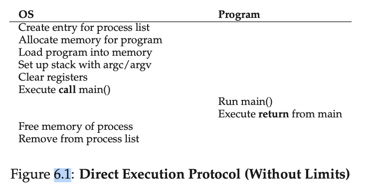

There are two main problems this model must solve:
### Problem 1: Restricted Operations

Certain operations, such as I/O or accessing privileged memory, must be restricted to prevent a process from harming the system.

* **User Mode vs. Kernel Mode**: The hardware supports two privilege levels:
    * **User Mode**: For applications, with restricted access to hardware.
    * **Kernel Mode**: For the OS (the kernel), with full, unrestricted access.
* **System Calls**: A user process must use a **system call** to request a privileged operation.
* **Trap Instruction**: A special hardware instruction that switches the CPU from user mode to kernel mode and jumps into a pre-defined OS handler.
* **Trap Table**: The OS sets this up at boot time to specify the addresses of its trap handlers. This ensures that a process can only jump to authorized entry points within the kernel.
* **Return-from-Trap**: A special instruction used by the OS to return to the user process, restoring its state and reverting to user mode.

---
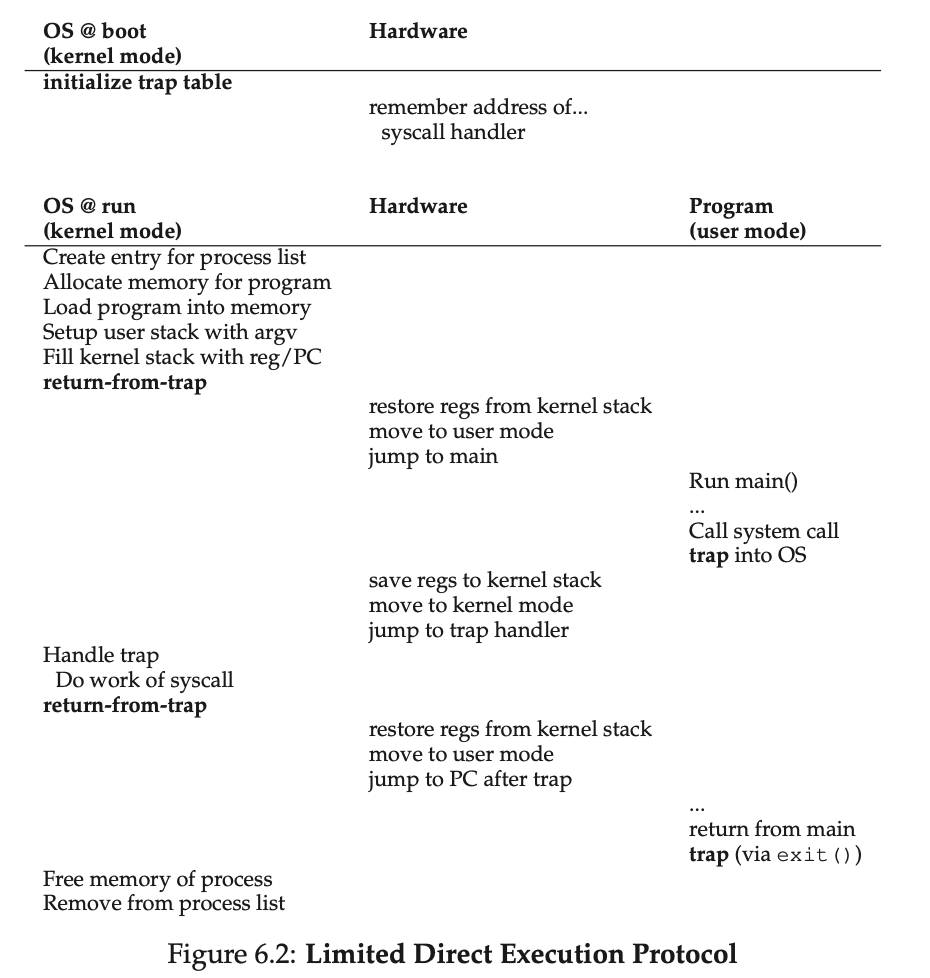
#### Putting It All Together (Flow)
- (1) User Program calls a library function like read().
- (2) The library executes a special instruction (syscall/int 0x80) → causes a trap.
- (3) CPU switches to kernel mode and jumps to the trap handler.
- (4) The trap handler examines the system call number (passed in registers).
- (5) The trap handler invokes the appropriate system call handler (sys_read()).
- (6) The system call handler performs the requested action.
- (7) When finished, the OS calls a special return-from-trap instruction, which, as you might expect, returns into the calling user program while simultaneously reducing the privilege level back to user mode.
- (8) The result is returned to the user program.

### Problem 2: Regaining Control of the CPU

Since the OS isn't running when a user process is, it needs a way to regain control to perform tasks like switching between processes.

* **Cooperative Approach**: The OS relies on processes to voluntarily give up the CPU by making a system call or using an explicit `yield()` call. This is unreliable, as a buggy or malicious process could enter an infinite loop and never give up control.
* **Non-Cooperative Approach (Preemption)**: Modern OSes use a **timer interrupt**. The OS programs a hardware timer to generate an interrupt after a set period. When the interrupt occurs, the hardware automatically stops the running process, saves its state, and forces a jump into the OS's timer interrupt handler.
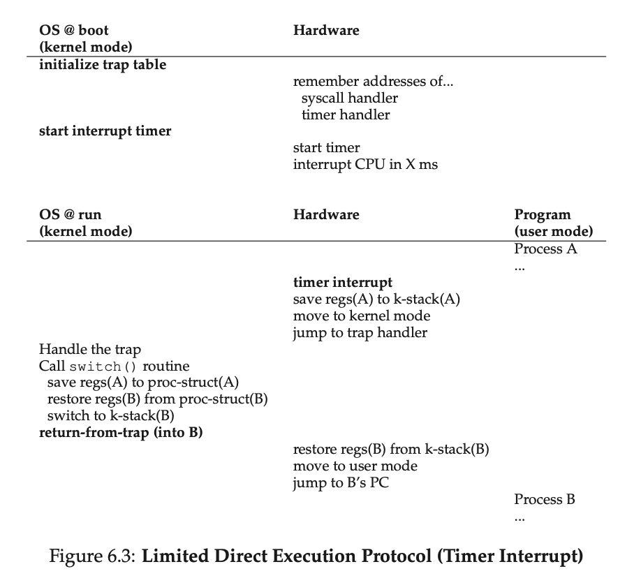
- Note that there are two types of register saves/restores that happen during this protocol. The first is when the timer interrupt occurs; in this case, the user registers of the running process are implicitly saved by the hardware, using the kernel stack of that process. The second is when the OS decides to switch from A to B; in this case, the kernel registers are explicitly saved by the software (i.e., the OS), but this time into memory in the process structure of the process. The latter action moves the system from running as if it just trapped into the kernel from A to as if it just trapped into the kernel from B.
- An operating system has one process list, but the process list is not the same as a PCB. The process list is a data structure, like a linked list or an array, that contains all the individual PCBs. Each process has its own PCB, and the process list is what holds all of these PCBs together, allowing the OS to manage all the processes in the system
---

### Context Switching

Once the OS regains control, it can perform a **context switch** to a different process. This is a low-level operation involving:
1.  **Saving State**: The OS saves the state (e.g., register values, program counter) of the current process into its **Process Control Block (PCB)**.
2.  **Loading State**: The OS loads the state of the new process from its PCB.
3.  **Switching Stacks**: The OS switches to the kernel stack of the new process.
4.  **Returning to New Process**: The OS uses a `return-from-trap` instruction, causing the hardware to restore the new process's registers and resume its execution.

The combination of hardware support (modes, traps, timer interrupts) and OS software is the foundation of Limited Direct Execution, enabling efficient CPU virtualization and protection.

### Summary of User Stack, Kernel Stack, and Process State

* **Process Control Block (PCB)**: A data structure used by the OS to manage all information about a single process. Each process has its own PCB, which is stored in a master **Process List** or **Process Table**.
* **Kernel Stack**: A dedicated stack for each process, used exclusively when the process is executing in **kernel mode** (e.g., during a system call or an interrupt). It provides a secure, isolated space for the kernel's operations.
* **User Stack**: The stack used by a process for its normal execution in **user mode**. It is part of the process's private address space and is where local variables and function call information are stored.

***

### Context Switching and State Preservation

A **context switch** is the process of the OS saving the state of the current process and restoring the state of another.

1.  **On Interrupt**: When a timer interrupt occurs, the hardware automatically saves the process's **user-mode registers** onto that process's **kernel stack**.
2.  **OS Takes Over**: The OS's timer interrupt handler then gains control. If it decides to switch processes, it performs a **software-based save** of the remaining kernel state (e.g., kernel stack pointer) into the process's **PCB**.
3.  **No User Stack Save**: The **user stack is not saved** during a context switch. It remains in the process's private memory space. The OS only needs to save the **CPU's state** (registers and kernel stack pointer) to enable a quick and efficient switch. Since each process's memory space is isolated, its user stack is preserved until the OS schedules it to run again.
---
✦━━━━━━━━━━━━━━━✦
   End of Chapter
✦━━━━━━━━━━━━━━━✦
---

# Chapter 7: Scheduling: Introduction

This chapter introduces the fundamental concepts of CPU scheduling, including common workload assumptions, key performance metrics, and various scheduling policies.

---

## Workload and Metrics

Before designing a scheduler, we make simplifying assumptions about the workload (the set of running jobs):
* All jobs are the same length.
* All jobs arrive at the same time.
* Jobs run to completion (non-preemptive).
* Jobs only use the CPU (no I/O).
* The run-time of each job is known beforehand.

These assumptions are later relaxed to develop more realistic policies.

To evaluate schedulers, we use key metrics:
* **Turnaround Time**: The time a job takes from arrival to completion. ($T_{turnaround} = T_{completion} - T_{arrival}$)
* **Response Time**: The time from a job's arrival until it first begins to run. ($T_{response} = T_{firstrun} - T_{arrival}$)

There is often an inherent trade-off between these two metrics.

---

## Scheduling Policies

### 1. First In, First Out (FIFO)
* **Policy**: Jobs are executed in the order they arrive.
* **Pros**: Simple and easy to implement.
* **Cons**: Can lead to the **convoy effect**, where a long-running job holds up all subsequent short jobs, resulting in poor average turnaround time.

### 2. Shortest Job First (SJF)
* **Policy**: The scheduler runs the job with the shortest run-time first.
* **Pros**: Optimal for minimizing average turnaround time, but only when all jobs arrive simultaneously and their lengths are known.
* **Cons**: Still suffers from the convoy effect if we relax assumption 2 i.e. jobs arrive at different times , and a longer job comes in just before bunch of shorter jobs

### 3. Shortest Time-to-Completion First (STCF)
* **Policy**: A preemptive version of SJF. When a new job arrives, the scheduler checks if its remaining time is shorter than the currently running job's. If so, it preempts the current job.
* **Pros**: Optimal for minimizing average turnaround time even with jobs arriving at different times.
* **Cons**: Terrible for **response time**. Short, new jobs can continuously preempt longer ones, causing a long delay before a job starts.

### 4. Round Robin (RR)
* **Policy**: The scheduler runs each job for a small, fixed time slice (or quantum), then switches to the next job in the queue.
* **Pros**: Excellent for **response time** and fairness. It ensures every job gets a turn to run, making the system feel responsive.
* **Cons**: Very poor for **turnaround time** because it stretches out the execution of all jobs. The overhead of context switching can also be significant if the time slice is too short.
* **NOTE**: the length of the time slice is critical for RR. The shorter it is, the better the performance of RR under the response-time metric. However, making the time slice too short is problematic: suddenly the cost of context switching will dominate overall performance. Thus, deciding on the length of the time slice presents a trade-off to a system de- signer, making it long enough to amortize the cost of switching without making it so long that the system is no longer responsive.

#### TIP: AMORTIZATION CAN REDUCE COSTS
- The general technique of amortization is commonly used in systems when there is a fixed cost to some operation. By incurring that cost less often (i.e., by performing the operation fewer times), the total cost to the system is reduced. For example, if the time slice is set to 10 ms, and the context-switch cost is 1 ms, roughly 10% of time is spent context switching and is thus wasted. If we want to amortize this cost, we can increase the time slice, e.g., to 100 ms. In this case, less than 1% of time is spent context switching, and thus the cost of time-slicing has been amortized.
---

## Incorporating I/O

To handle jobs that perform I/O, the scheduler should treat each **CPU burst** (a period of CPU usage between I/O requests) as a separate job. When a process initiates an I/O request, it becomes blocked, and the OS can schedule another job. This allows for **overlap** of I/O and CPU work, improving overall system utilization.

---

## The "No More Oracle" Problem

A major problem with SJF and STCF is the unrealistic assumption that the OS knows the length of each job in advance. Real-world schedulers must overcome this by predicting job lengths, a topic that will be addressed in the discussion of the multi-level feedback queue.

---
✦━━━━━━━━━━━━━━━✦
   End of Chapter
✦━━━━━━━━━━━━━━━✦
---

# Chapter 8: The Multi-Level Feedback Queue (MLFQ)

MLFQ is a dynamic scheduling algorithm that balances the goals of minimizing both **response time** for interactive jobs and **turnaround time** for short jobs, without prior knowledge of job lengths. It achieves this by observing a job's behavior and adjusting its priority accordingly.

---

## Core Principles

MLFQ uses a set of queues, each with a different priority level. A scheduler operates based on these rules:

* **Rule 1**: A job in a higher-priority queue runs before a job in a lower-priority queue.
* **Rule 2**: Jobs in the same queue are scheduled using **Round Robin (RR)**.
* **Rule 3**: New jobs enter the highest-priority queue. This assumes they might be interactive, short-running tasks.
* **Rule 4**: Once a job uses up its time allotment at a given level (regardless of how many times it has given up the CPU), its priority is reduced (i.e., it moves down one queue).
* **Rule 5**: To prevent **starvation** and adapt to changes in job behavior, all jobs are periodically moved to the highest-priority queue (a **priority boost**).

---

## MLFQ in Action

* **Learning**: By starting jobs at a high priority (Rule 3) and demoting them if they use their full time slice (Rule 4), MLFQ learns to differentiate between short jobs (which complete quickly) and long jobs (which are demoted). This approximates **SJF** and **STCF**.
* **Responsiveness**: Interactive jobs often yield the CPU before their time slice is up (e.g., waiting for I/O). Rule 4's demotion criteria (using the *entire* time slice) ensures these jobs stay at a high priority, providing good **response time**.
* **Anti-Gaming**: A refined version of Rule 4 prevents "gaming" by tracking total CPU time used at a given priority level, not just single time slices. A job is demoted once it exhausts its total time allotment, regardless of how many times it yielded the CPU.
* **Solving Starvation**: The periodic priority boost (Rule 5) ensures that all jobs, even those at the lowest priority, will eventually get a chance to run. It also helps interactive jobs that have been mistakenly demoted return to a high-priority state.

---

## Tuning and Trade-offs

The performance of an MLFQ scheduler depends on various configurable parameters, often called "voo-doo constants":

* **Number of Queues**: The number of priority levels.
* **Time Slice Length**: Shorter time slices are used for high-priority queues to benefit interactive jobs, while longer ones are used for low-priority queues to improve throughput for CPU-bound jobs.
* **Priority Boost Interval**: This interval is a key trade-off. A value that is too high can lead to starvation, while one that is too low can negate the benefits of MLFQ for interactive jobs.

Many modern operating systems, including variants of UNIX and Windows, use some form of MLFQ as their default scheduler due to its effectiveness.

---
✦━━━━━━━━━━━━━━━✦
   End of Chapter
✦━━━━━━━━━━━━━━━✦
---

# Chapter 9: Scheduling: Proportional Share

In this chapter, we’ll examine a different type of scheduler known as a **proportional-share scheduler**, also sometimes referred to as a **fair-share scheduler**. Proportional-share is based around a simple concept: instead of optimizing for turnaround or response time, a scheduler might instead try to guarantee that each job obtain a certain percentage of CPU time.

---

## Key Concepts

### Tickets:
A mechanism used to represent a process's share of the CPU. The percentage of total tickets a process holds corresponds to its CPU allocation. For example, a process with 75 tickets out of 100 total will aim for 75% of the CPU time.
### Ticket Mechanisms:

#### 1. Ticket Currency 💰
This mechanism simplifies ticket management for groups of jobs. It allows a user to distribute tickets to their own jobs using a private "currency" that is then automatically converted to the global ticket count. This abstracts away the complexity of managing global ticket values.

**Example**:
* **User A** has a total global allocation of 100 tickets. They are running two jobs, `A1` and `A2`, and want them to have equal priority.
* **User A** assigns 500 tickets (in their local currency) to `A1` and 500 tickets to `A2`. The total local currency is 1000.
* The system converts this: `A1` and `A2` each get `(500 / 1000) * 100 = 50` global tickets.

Similarly, if **User B** has 100 tickets and is running one job, `B1`, they can assign it 10 tickets in their local currency. The system would convert this to `(10 / 10) * 100 = 100` global tickets. In the final lottery, `A1` and `A2` will compete with `B1` based on a total global ticket pool of 200, with shares of 50, 50, and 100, respectively.

#### 2. Ticket Transfer 🤝
This mechanism allows a process to temporarily transfer its tickets to another process. It's particularly useful in client-server scenarios to prioritize work.

**Example**:
* A **client process** needs a file system **server** to retrieve a file on its behalf.
* The client, which has its own tickets, can temporarily transfer them to the server.
* The server's priority is boosted while it handles the client's request, ensuring the I/O operation completes quickly.
* Once the work is done, the server returns the tickets to the client. This is a form of **protected control transfer**, where a client can transfer a capability (tickets) to another process without giving it full control.

#### 3. Ticket Inflation 📈
This mechanism allows a process to temporarily increase or decrease its own ticket count. This is not suitable for competitive environments where processes don't trust each other, as a greedy process could monopolize the CPU. Instead, it is used in cooperative scenarios.

**Example**:
* A group of trusted processes are running together to solve a complex problem.
* If one process, say a rendering job, enters a computationally intensive phase and needs more CPU time temporarily, it can **inflate** its own ticket count.
* This is done without communicating with other processes, providing a lightweight way for a job to signal its temporary need for more resources. The other processes trust that this inflation is justified, and the scheduler will adjust the lottery odds accordingly.

---

## Lottery Scheduling

* **Approach**: A randomized proportional-share scheduler. The scheduler holds a "lottery" at the beginning of each time slice by picking a random winning ticket. The process holding that ticket is scheduled to run.
* **Pros**:
    * **Simplicity**: Easy to implement.
    * **Robustness**: The use of randomness avoids worst-case scenarios and requires little state to track.
    * **Dynamic**: Easily accommodates new processes by simply adding their tickets to the total.
* **Cons**:
    * **Probabilistic Guarantees**: Doesn't guarantee exact proportions over short periods, only probabilistically over a long time.
    * **I/O Challenges**: Does not mesh well with I/O-intensive jobs.

### How To Assign Tickets?
This problem is a tough one, because of course how the system behaves is strongly dependent on how tickets are allocated. One approach is to assume that the users know best; in such a case, each user is handed some number of tickets, and a user can allocate tickets to any jobs they run as desired. However, this solution is a non-solution: it really doesn’t tell you what to do. Thus, given a set of jobs, the “ticket-assignment problem” remains open.

### Example of Lottery Scheduling

Let's imagine a system with three jobs: A, B, and C, competing for CPU time. They have been assigned tickets as follows:

* **Job A**: 75 tickets (50% of total)
* **Job B**: 25 tickets (16.7% of total)
* **Job C**: 50 tickets (33.3% of total)

The **total number of tickets** in the system is $75 + 25 + 50 = 150$.

The scheduler holds a lottery at the beginning of each time slice by picking a random number from 1 to 150. A winning number falls within the ticket range for a specific job, and that job is scheduled. 

| Round | Winning Number | Winner (Ticket Range) |
| :---: | :---: | :---: |
| 1 | 88 | **Job B** (76-100) |
| 2 | 31 | **Job A** (1-75) |
| 3 | 120 | **Job C** (101-150) |
| 4 | 5 | **Job A** (1-75) |
| 5 | 145 | **Job C** (101-150) |
| 6 | 95 | **Job B** (76-100) |
| 7 | 64 | **Job A** (1-75) |
| 8 | 108 | **Job C** (101-150) |
| 9 | 20 | **Job A** (1-75) |
| 10 | 115 | **Job C** (101-150) |
| 11 | 90 | **Job B** (76-100) |
| 12 | 22 | **Job A** (1-75) |

Over many rounds, the scheduler will **probabilistically converge** on the desired proportional share for each job. In this 12-round example:

* **Job A**: 5 rounds (41.7%)
* **Job B**: 3 rounds (25%)
* **Job C**: 4 rounds (33.3%)

As the number of rounds increases, the observed percentages will more closely match the ticket allocation.
### TIP: USE RANDOMNESS 
One of the most beautiful aspects of lottery scheduling is its use of randomness. Random approaches has at least **three advantages** over more traditional decisions. 
* **First**, random often avoids strange corner-case behaviors that a more traditional algorithm may have trouble handling. For example, consider the LRU replacement policy (studied in more detail in a future chapter on virtual memory); while often a good replacement algorithm, LRU performs pessimally for some cyclic-sequential workloads. Random, on the other hand, has no such worst case.
* **Second**, random also is lightweight, requiring little state to track alternatives. In a traditional fair-share scheduling algorithm, tracking how much CPU each process has received requires per-process accounting, which must be updated after running each process. Doing so randomly necessitates only the most minimal of per-process state (e.g., the number of tickets each has).
* **Finally**, random can be quite fast. As long as generating a random number is quick, making the decision is also, and thus random can be used in a number of places where speed is required. Of course, the faster the need, the more random tends towards pseudo-random.

---

## Stride Scheduling

* **Approach**: A deterministic proportional-share scheduler. Each job has a **stride** (inversely proportional to its tickets) and a **pass** value (tracking its progress). The scheduler always runs the job with the lowest pass value and then increments that job's pass by its stride.
* **Pros**:
    * **Deterministic**: Guarantees exact proportional allocation over a scheduling cycle.
* **Cons**:
    * **Complexity**: Requires global state, making it more difficult to handle new jobs arriving dynamically, as their initial pass value must be set carefully.
    
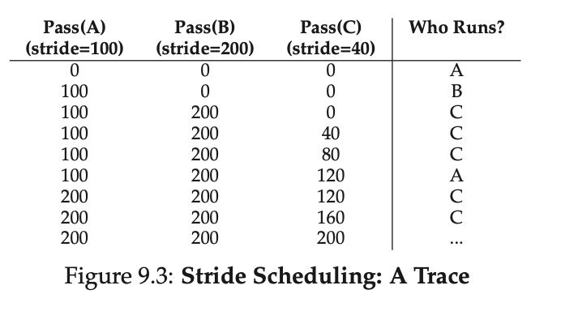
---

## Real-World Usage

- While conceptually elegant, proportional-share schedulers like Lottery and Stride are not widely used as general-purpose CPU schedulers. The main reason is the **ticket assignment problem**: it's difficult to determine how many tickets to allocate to different processes in a general-purpose OS. However, they are effective in controlled environments like virtualized data centers where shares can be logically assigned to different virtual machines.
---
✦━━━━━━━━━━━━━━━✦
   End of Chapter
✦━━━━━━━━━━━━━━━✦
---

# Chapter 10 – NOT READ YET


---
✦━━━━━━━━━━━━━━━✦
   End of Chapter
✦━━━━━━━━━━━━━━━✦
---

# Chapter 11 – Summary Dialogue on CPU Virtualization

**Key Takeaways**

- **Mechanisms of CPU Virtualization**
  - Traps and trap handlers
  - Timer interrupts
  - Saving/restoring process state during context switches

- **OS Philosophy**
  - The OS is "paranoid" → always wants to stay in control.
  - Balances efficiency (limited direct execution) with safety (interrupting errant processes).
  - Acts as a **resource manager**.

- **Scheduling Policies**
  - Short jobs first (SJF) analogy → bumping small tasks ahead improves efficiency.
  - Multi-Level Feedback Queue (MLFQ) tries to combine SJF and RR (Round Robin).
  - Building a smart scheduler is difficult; still debated (e.g., Linux: CFS, BFS, O(1)).
  - Trade-offs exist:
    - Good turnaround time ↔ bad response time.
    - No perfect solution → goal is to avoid disaster.

- **Engineering Perspective**
  - Not all problems have clean solutions.
  - Pragmatism is key in OS design.


**Overall Message:**  
OS design blends mechanisms and policies, driven by efficiency, protection, and pragmatism. Schedulers embody trade-offs, and understanding them deepens insight into how the OS manages resources.


---
✦━━━━━━━━━━━━━━━✦
   End of Chapter
✦━━━━━━━━━━━━━━━✦
---

# Chapter 12 – A Dialogue on Memory Virtualization

**Key Takeaways**

- **Virtualization isn’t done yet**
  - CPU virtualization is only one part.
  - Memory virtualization is a bigger challenge with more intricate OS–hardware interactions.

- **Why Memory Virtualization is Hard**
  - Many technical details must be tracked.
  - Requires understanding mechanisms like:
    - Base and bounds registers
    - Translation Lookaside Buffers (TLBs)
    - Multi-level page tables
  - Goal: build a mental model of a modern virtual memory manager.

- **Core Idea**
  - Every address generated by a **user program** is a **virtual address**.
  - OS + hardware translate virtual → physical addresses.
  - Provides the **illusion** that each process has:
    - A large, private, contiguous memory space.

- **Benefits of Memory Virtualization**
  1. **Ease of use for programmers**
     - Programs don’t need to worry about memory layout or fitting code/data into small memory regions.
  2. **Isolation and protection**
     - Prevents processes from reading or overwriting each other’s memory.
     - Errant processes are terminated to preserve system stability.


---
✦━━━━━━━━━━━━━━━✦
   End of Chapter
✦━━━━━━━━━━━━━━━✦
---

# Chapter 13: The Abstraction: Address Spaces

This chapter introduces the fundamental concept of the **address space**, a core abstraction in modern operating systems that provides each process with its own private, isolated memory.

---

### The Evolution of Memory Management

* **Early Systems**: In the earliest computers, there was no memory abstraction. A single program ran at a time and had full, unrestricted access to all of the machine's physical memory, starting from a fixed location (e.g., 64KB).
* **Multiprogramming and Time Sharing**: As computers became more expensive and demand for interactivity grew, the need for **multiprogramming** (running multiple processes) and **time sharing** (switching between them) emerged. This required keeping multiple processes in memory simultaneously. This introduced a critical problem: how to prevent one process from interfering with another's memory?
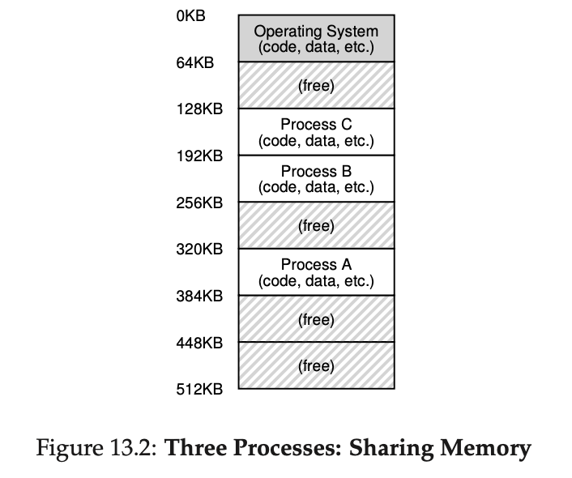
### Execution Models Comparison

| Model              | Key Idea                          | Goal             | User Interaction |
|--------------------|-----------------------------------|------------------|------------------|
| **Batch**          | Jobs run sequentially             | Throughput       | None             |
| **Multiprogramming** | Multiple jobs in memory, CPU switches on I/O | Efficiency       | Limited/None     |
| **Time Sharing**   | CPU time sliced among users/jobs  | Responsiveness   | Interactive      |
| **Modern OS**      | Mix of both + multicore, virtualization | Efficiency + Responsiveness + Security | Interactive |


---

### The Address Space: An Abstraction

The **address space** is the solution to this problem. It is an **abstraction** created by the OS, with hardware support, that presents a program with a private, seemingly contiguous view of memory. This is an illusion; the program's addresses are **virtual addresses**, which the OS and hardware translate into **physical addresses** in the machine's actual RAM(main memory).

A process's address space typically contains:
* **Code**: The program's instructions.
* **Stack**: Used for function calls and local variables. It typically grows downward from a high memory address.
* **Heap**: Used for dynamically allocated memory (e.g., via `malloc`). It grows upward, towards the stack.

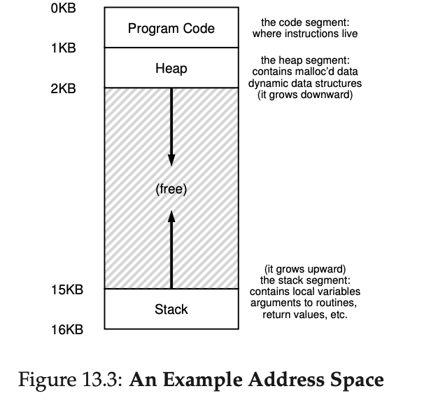
---

### Goals of Virtualizing Memory

The OS virtualizes memory with three primary goals:

1.  **Transparency**: The virtualization should be invisible to the running program. The program should behave as if it has its own private, dedicated physical memory. 
2.  **Efficiency**: The process of translating virtual addresses to physical addresses must be performed quickly. This relies on hardware support (e.g., TLBs).
3.  **Protection**: The OS must **isolate** processes from each other, ensuring a process cannot access or modify the memory of another process or the OS itself. This prevents bugs or malicious behavior in one program from affecting the entire system.
---
✦━━━━━━━━━━━━━━━✦
   End of Chapter
✦━━━━━━━━━━━━━━━✦
---

# Chapter 14: Interlude: Memory API

This chapter focuses on the memory allocation and management interfaces in UNIX and C programming, primarily covering stack and heap memory, and common programming errors.

---

### Types of Memory

* **Stack Memory**: Also known as **automatic memory**. The compiler implicitly manages its allocation and deallocation. It's used for local variables and function call management. Memory on the stack is short-lived; it is deallocated when the function returns.
* **Heap Memory**: This memory is explicitly managed by the programmer. It's used for dynamic data that needs to persist beyond a function's lifetime.

---

### Key Memory Allocation Calls

* `malloc()`: The primary function for allocating memory on the heap.
    * **Syntax**: `void *malloc(size_t size)`
    * **Function**: Takes a size in bytes and returns a pointer to the newly allocated memory block. It returns `NULL` on failure.
    * **Best Practice**: Use `sizeof()` to determine the size of the data type (e.g., `malloc(sizeof(int))`) for portability and readability. `sizeof()` is a compile-time operator, not a function.

* `free()`: The function for deallocating memory previously allocated with `malloc()`.
    * **Syntax**: `void free(void *ptr)`
    * **Function**: Takes a pointer to a memory block and returns it to the free list. The programmer is responsible for calling `free()` to prevent memory leaks.

* `calloc()`: Allocates memory and initializes it to zero.
* `realloc()`: Resizes a previously allocated memory block.

---

### Common Programming Errors

* **Forgetting to Allocate Memory**: Using a pointer before calling `malloc()`, which often results in a **segmentation fault**.
* **Not Allocating Enough Memory**: An **underflow or buffer overflow**, where a program writes past the end of an allocated buffer. This can lead to security vulnerabilities and crashes.
* **Forgetting to Initialize Memory**: Using a newly allocated memory block without initializing it, leading to unpredictable program behavior.
* **Memory Leaks**: Occurs when a program forgets to call `free()` on allocated memory. In long-running applications, this can exhaust all available memory.
* **Dangling Pointer**: A pointer that refers to memory that has already been freed.
* **Double Free**: Calling `free()` on the same memory block more than once.
* **Incorrect `free()`**: Calling `free()` on a pointer that was not returned by `malloc()`.

---

### OS Support

* `malloc()` and `free()` are **library calls**, not system calls.
* The `malloc` library itself relies on underlying system calls like `brk` or `mmap` to request larger chunks of memory from the operating system.
* The OS manages memory at the page level. When a process exits, the OS reclaims all of its allocated pages, regardless of whether the program called `free()`.

---
✦━━━━━━━━━━━━━━━✦
   End of Chapter
✦━━━━━━━━━━━━━━━✦
---

# Chapter 15: Mechanism: Address Translation

This chapter explains how modern operating systems (OS) and hardware cooperate to create the illusion of a private, dedicated memory for each process, a process known as **address translation**.

---

## The Problem of Virtualization

To enable multiprogramming, multiple processes must reside in memory simultaneously. The OS must provide each process with a simplified, contiguous view of memory (the **address space**) while protecting them from each other. This illusion requires a mechanism to convert a program's **virtual addresses** into the actual **physical addresses** in the computer's RAM. This conversion is handled by the hardware, and the process is called **dynamic relocation**.

---
## Interposition in Operating Systems

- **Interposition** is a technique where an extra layer is inserted between a **client** and a **service/resource**, allowing the system to **intercept, modify, or monitor** requests.

### Example: Memory Virtualization
- Hardware **interposes** on each memory access.  
- Translates **virtual addresses → physical addresses**.  
- Transparent to the program (program believes it has direct access to memory).

---
## Software-Based Relocation

### Definition
- Early technique for memory relocation **before hardware support existed**.
- Known as **static relocation**.
- Handled by the **loader**, which rewrites program addresses before execution.


### How It Works
- Program assumes it starts at address `0`.
- Loader adjusts all addresses by an **offset** when loading into memory.
- Example:  
  - Original instruction: `movl 1000, %eax`  
  - If program loaded at address `3000` → loader rewrites to `movl 4000, %eax`.


### Advantages
- Simple way to relocate programs in memory.
- Works entirely in **software** without hardware support.


### Problems
1. **No Protection**:  
   - Processes can still access invalid or other processes' memory.  
   - OS/other processes vulnerable to corruption.
2. **Not Flexible**:  
   - Once placed, program is **hard to relocate again**.
3. **Scalability Issues**:  
   - As systems grew, software-only relocation became impractical.  
   - Led to need for **hardware support** (e.g., base and bounds, paging).

---


## Base-and-Bounds Translation

A simple and early form of hardware-based address translation is **base-and-bounds relocation**. This mechanism uses two specialized CPU registers:

* **Base Register**: Holds the starting physical address where a process's code and data are loaded.
* **Bounds Register**: Stores the size (or limit) of the process's address space.

For every memory access (e.g., a load or store instruction), the CPU's **Memory Management Unit (MMU)** performs two steps:
1.  **Protection Check**: It checks if the `virtual_address` is within the valid range defined by the `bounds_register`. If it's too large, it triggers an exception.
2.  **Address Translation**: If the address is valid, it calculates the `physical_address` by adding the `virtual_address` and the `base_register` (`physical_address = virtual_address + base_register`).

---

## ASIDE: DATA STRUCTURE — THE FREE LIST
The OS must track which parts of free memory are not in use, so as to be able to allocate memory to processes. Many different data structures can of course be used for such a task; the simplest (which we will assume here) is a free list, which simply is a list of the ranges of the physical memory which are not currently in use.

---
## Hardware Support

This virtualization relies on specific hardware features:

* **Dual-Mode Operation**: The CPU must support a privileged **kernel mode** for the OS and a restricted **user mode** for applications.
* **Special Registers**: The MMU contains the base and bounds registers.
* **Privileged Instructions**: Only the OS (in kernel mode) can modify the base and bounds registers. Any attempt by a user program to do so will cause an exception.
* **Exception Handling**: The hardware generates exceptions for illegal memory accesses (e.g., an out-of-bounds address), which the OS then handles, typically by terminating the misbehaving process.

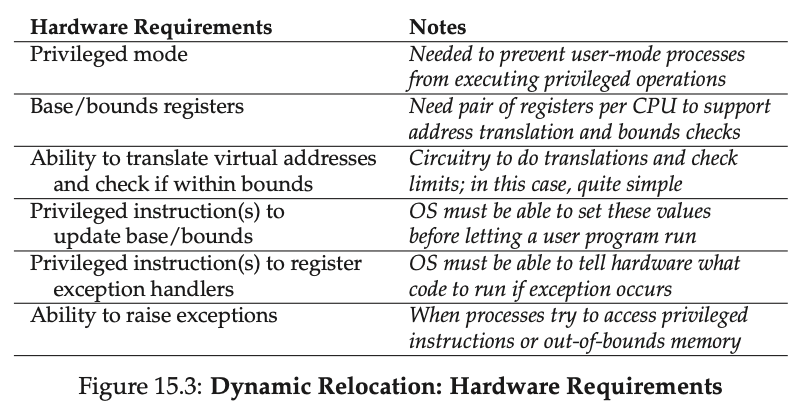


---
## Operating System Issues

The OS must actively manage the virtual memory system by handling memory allocation, hardware register updates, and exceptions, thereby enabling the hardware to perform dynamic address translation.


### Operating System Responsibilities

The OS must intervene at critical junctures to manage the simple base-and-bounds virtual memory scheme:

1.  **Memory Management (Allocation & Reclaiming):**
    * **Process Creation:** The OS searches a **free list** data structure to find a **contiguous slot** of available physical memory for the new process's address space.
    * **Process Termination:** The OS **reclaims** the process's memory block and returns it to the free list for future use.

2.  **Base-and-Bounds Management (Context Switch):**
    * Since there is only one pair of hardware registers, the OS must save and restore them during a **context switch**.
    * When stopping a process, the OS **saves** the current Base and Bounds register values into the process's **Process Control Block (PCB)**.
    * When starting/resuming a process, the OS **restores** the correct Base and Bounds values from the PCB into the CPU's registers.

3.  **Address Space Relocation:**
    * When a process is *not* running, the OS can **move** its entire address space to a new physical location.
    * It copies the memory contents and updates the **saved Base register value** in the PCB. The process remains **transparently** unaware of the move.

4.  **Exception Handling:**
    * The OS installs handlers (at boot time) for hardware exceptions.
    * If a process attempts an illegal memory access (e.g., out-of-bounds), the CPU raises an exception, and the OS's handler takes over, typically **terminating** the misbehaving process.

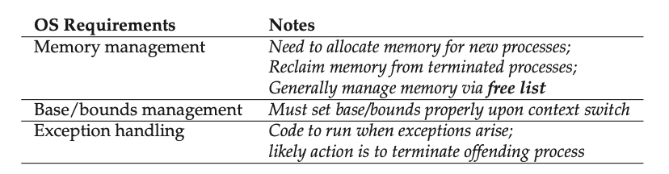
---
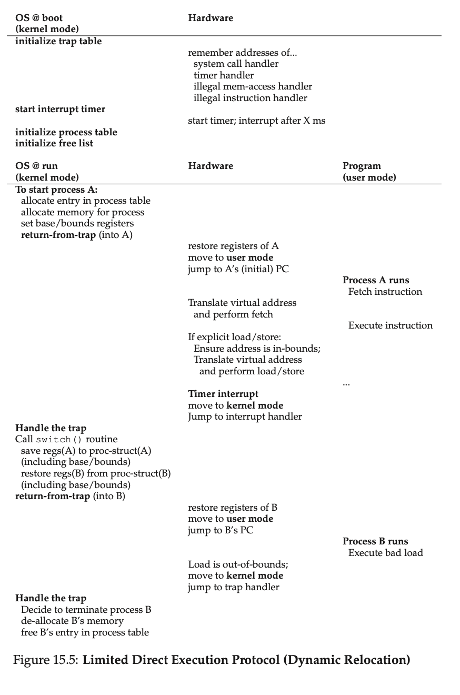
### System Inefficiency: Internal Fragmentation

The simple base-and-bounds approach, while efficient in execution, leads to poor memory utilization due to the requirement that the entire address space must be loaded contiguously.

* **Problem:** The space between the heap (growing up) and the stack (growing down) is often entirely unused but still reserved within the allocated physical block.
* **Result:** This wasted, unused space *inside* the allocated block is called **internal fragmentation**. This inefficiency drives the need for more complex virtualization methods like segmentation.
---
✦━━━━━━━━━━━━━━━✦
   End of Chapter
✦━━━━━━━━━━━━━━━✦
---

# Chapter 16: Segmentation

Segmentation generalizes the base-and-bounds approach to solve the problem of wasted memory between the stack and the heap, allowing for the efficient use of sparse address spaces.

---

### 1. Segmentation: Generalized Base/Bounds

Segmentation treats the address space as a collection of **logical segments** (Code, Heap, Stack), each managed independently with its own pair of **Base** and **Bounds** registers.

* **Goal:** To avoid allocating physical memory for the large, unused gaps (sparse space) between the logical segments, which was the main cause of **internal fragmentation** in the simple base-and-bounds scheme.
* **Mechanism:** Each segment can be placed in a different, non-contiguous location in physical memory.

---

### 2. Address Translation
#### A. Implicit Approach (Using Program Counter/Pointers)
The hardware determines the segment based on *how* the address was generated by the CPU.

- Process:
    - If the address was generated from the **Program Counter (PC)** (i.e., an instruction fetch), it is assumed to be in the **Code Segment**.
    - If the address is based off the **Stack or Base Pointer**, it is assumed to be in the **Stack Segment**.
    - Any other address (e.g., for dynamically allocated data) is typically assumed to be in the **Heap Segment**.

#### B. Explicit Approach (Using Address Bits)
The most common method is to use a fixed portion of the virtual address, typically the **top few bits**, to select the segment ID.

* **Process:** The hardware uses the top bits (e.g., 2 bits for 3 segments) to index into the array of (Base, Bounds) registers. The remaining lower bits are treated as the **offset** into the selected segment.
* **Example:** For a 14-bit VA, the top two bits (bits 13 and 12) might select the segment, and the bottom 12 bits define the offset.


To translate a **virtual address (VA)**, the hardware must first identify the segment and the offset within that segment.

| Component | Example |
| :--- | :--- |
| **Hardware** | Multiple (Base, Bounds) register pairs in the MMU. |
| **Segment Identification (Explicit)** | The **top bits** of the VA specify the segment (e.g., top 2 bits for 3 segments). |
| **Offset** | The remaining bits of the VA represent the offset into that segment. |
| **Protection Check** | Hardware checks if the `Offset` is less than the segment's `Bounds` (size). Failure results in a **segmentation fault**. |
| **Physical Address (PA)** | $PA = \text{Segment Base} + \text{Offset}$ |

**Stack Exception (Negative Growth):**
The stack grows backward (negatively). The hardware needs an extra bit to track this direction. Translation for a negative-growth segment requires a different offset calculation (e.g., subtracting the maximum segment size from the VA) before adding the Base.

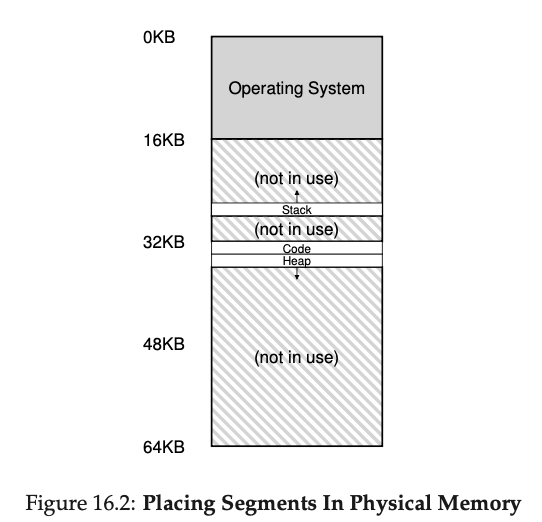
---

### 3. Advanced Features

* **Protection Bits:** Per-segment bits (Read, Write, Execute) are added to enforce access permissions. Attempting to write to a read-only code segment causes an exception.
* **Sharing:** Setting code segments to Read-Execute allows the OS to map the **same physical segment** into the address spaces of multiple processes, saving memory.

---

### 4. Operating System Issues

Segmentation solves internal fragmentation but introduces a severe new problem due to variable-sized segments.

* **External Fragmentation:** Over time, allocating and freeing variable-sized segments leaves physical memory with many small, unusable holes. Even if enough total free memory exists for a request, it may not be in one **contiguous block**.
    * **Mitigation:** The OS must use sophisticated **free-list management algorithms** (like best-fit) or perform expensive memory **compaction** (moving allocated segments to consolidate free space).

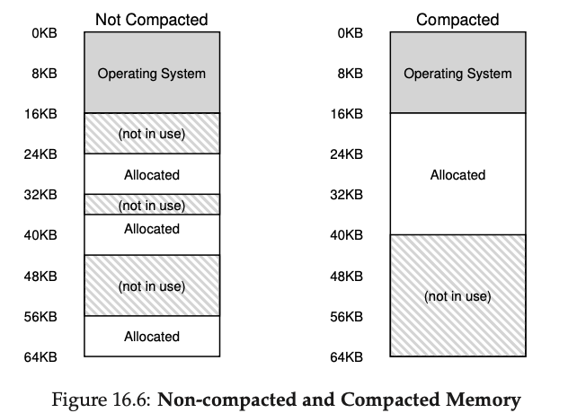

- The difficulty of managing variable-sized chunks and external fragmentation ultimately motivated the development of **paging**, which uses fixed-size chunks.
---
✦━━━━━━━━━━━━━━━✦
   End of Chapter
✦━━━━━━━━━━━━━━━✦
---

# Chapter 17: Free-Space Management

This chapter addresses the challenge of managing free space when dealing with **variable-sized memory requests**, a problem common in `malloc` libraries and in OS memory management using segmentation.

---

### The Crux: External Fragmentation

The main problem is **external fragmentation**: free memory gets chopped into small, non-contiguous chunks, causing large allocation requests to fail even if the total free space is sufficient.

**Assumptions for Allocator Discussion:**
1.  **Variable-Sized Requests** must be satisfied.
2.  **No Relocation/Compaction** of allocated memory is possible.
3.  Memory is managed via a **Free List** (a data structure tracking free chunks).

---


### Low-Level Mechanisms

These mechanisms are essential for all variable-sized allocators:

1.  **Splitting and Coalescing:**
    * **Splitting:** When an allocation request is smaller than a free chunk, the chunk is split. The requested part (plus header) is returned, and the remainder stays on the free list.
    * **Coalescing:** When a block is freed, the allocator merges it with any adjacent free chunks in memory to form a single, larger free block. This is critical to combat external fragmentation.

2.  **Tracking Allocated Size (Header Block):**
    * Since `free(ptr)` doesn't take a size, the allocator stores a small **header block** immediately *before* the memory block handed to the user.
    * The header minimally contains the size of the allocated region. The allocator uses pointer arithmetic on the passed `ptr` to find and read this header upon deallocation.
    * Note the small but critical detail, the size of the free region is the size of the header plus the size of the space allocated to the user. Thus, when a user requests bytes of memory, the library does not search for a free chunk of size ; rather,it searches for a free chunk of size plus the size of the header.

3.  **Embedding the Free List:**
    * The free list structure (`size`, `next` pointer) must be built *inside* the free memory blocks themselves, not allocated separately.

4.  **Growing the Heap:**
    * If the heap runs out of space, traditional allocators request more memory from the OS via system calls like `sbrk`.

---

### Basic Free-Space Strategies

These policies determine which free block to choose to satisfy an allocation request, trading off speed and fragmentation.

| Strategy | Description | Trade-offs |
| :--- | :--- | :--- |
| **Best Fit** | Searches the entire list to find the **smallest** free chunk that is still big enough. | **Pro:** Minimizes wasted space (small leftovers). **Con:** Slow (exhaustive search); leaves many tiny, fragmented blocks. |
| **Worst Fit**| Searches the entire list to find the **largest** free chunk. | **Pro:** Attempts to preserve large chunks. **Con:** Slow (exhaustive search); generally performs poorly, leading to excess fragmentation. |
| **First Fit** | Finds and uses the **first** block that is big enough. | **Pro:** Fast (no exhaustive search). **Con:** Tends to fragment the beginning of the free list. |
| **Next Fit** | Starts the search from where the last allocation finished, wrapping around the list. | **Pro:** Spreads allocations more uniformly. **Con:** Performance is similar to First Fit. |

---

### Advanced Approaches

More sophisticated techniques focus on improved speed and fragmentation control:

1.  **Segregated Lists:**
    * Keeps separate free lists dedicated to managing objects of one (or a few) popular sizes (e.g., the **Slab Allocator**).
    * **Benefit:** Very fast allocation/deallocation for common sizes; virtually eliminates fragmentation for those sizes.

2.  **Buddy Allocation (Binary Buddy):**
    * Manages free space in **power-of-two** sized blocks ($2^N$).
    * **Mechanism:** Allocation involves recursively splitting a block until a suitable size is found.
    * **Benefit:** Coalescing is extremely simple and fast because a block's "buddy" is easily calculated via its address.
    * **Drawback:** Can lead to **internal fragmentation** since blocks are often returned slightly larger than requested.

---
### Internal vs. External Fragmentation

Fragmentation is the waste of memory space that occurs when memory is allocated and deallocated over time.

| Feature | Internal Fragmentation 🗑️ | External Fragmentation 🔪 |
| :--- | :--- | :--- |
| **Definition** | Unused space *inside* an allocated memory unit. | Unused space *outside* allocated units; free space is scattered into many small, non-contiguous blocks. |
| **Cause** | Allocator returns a block larger than the requested size (e.g., due to fixed block sizes, like in **Paging** or **Buddy Allocation**). | Allocations and deallocations of **variable-sized** units (like in **Segmentation** or `malloc` libraries) chop up the free list. |
| **Wasted Space** | The difference between the allocated block size and the requested size. | The scattered, un-coalesced free space that is too small to satisfy a large request. |
| **Mitigation** | Can be reduced by using smaller, more numerous fixed block sizes, but cannot be entirely eliminated. | Minimized by efficient **free-space management** (e.g., Best Fit, coalescing) or completely eliminated by **Paging** (fixed-size units). |
| **Examples** | The unused gap between the stack and heap in a single **Base-and-Bounds** allocation. The leftover space in a power-of-two block returned by a **Buddy Allocator**. | The scattered holes of free memory when using **Segmentation**. The inability to satisfy a large request in a fragmented **Heap**. |

---
✦━━━━━━━━━━━━━━━✦
   End of Chapter
✦━━━━━━━━━━━━━━━✦
---

# Chapter 18: Paging: Introduction
It is sometimes said that the operating system takes one of two approaches , when solving most any space-management problem. The first approach is to chop things up into variable-sized pieces, as we saw with segmentation in virtual memory. Unfortunately, this solution has inherent difficulties. In particular, when dividing a space into different-size chunks, the space itself can become fragmented, and thus allocation becomes more challenging over time.
Paging is the **second** major approach to memory virtualization, dividing memory into **fixed-sized units** to avoid the **external fragmentation** issue inherent in segmentation.

---

### 1. Paging: The Core Concept

| Concept | Description |
| :--- | :--- |
| **Page** | A fixed-sized unit of a process's **Virtual Address Space (AS)**. |
| **Page Frame** | A fixed-sized slot of **Physical Memory (RAM)**, equal in size to a page. |
| **Page Table** | A **per-process** data structure maintained by the OS to map **Virtual Page Numbers (VPNs)** to **Physical Frame Numbers (PFNs)**. Stored in **physical memory**. |
| **Goal** | To scatter a process's pages across non-contiguous page frames, efficiently supporting **sparse address spaces** and eliminating **external fragmentation**. |

---

### 2. Address Translation with Paging

The hardware (MMU) translates a Virtual Address (VA) into a Physical Address (PA).

#### A. Splitting the Virtual Address (VA)

The VA is split based on the fixed page size:
$$\text{VA} = \text{Virtual Page Number (VPN)} + \text{Offset}$$
* **VPN:** High-order bits used to index the Page Table.
* **Offset:** Low-order bits specifying the byte within the page. **The Offset is NOT translated.**

#### B. Translation Lookup

1.  **PTE Address Calculation:** The hardware uses the **Page-Table Base Register (PTBR)** and the VPN to find the address of the PTE in physical memory:
    $$\text{PTE Address} = \text{PTBR} + (\text{VPN} \times \text{Size of PTE})$$
2.  **PTE Fetch:** **One memory access** is performed to fetch the PTE.
3.  **PFN Extraction:** The Physical Frame Number (PFN) is extracted from the PTE.
4.  **Physical Address Calculation:** The PFN is concatenated with the original Offset:
    $$\text{PA} = \text{PFN} + \text{Offset}$$
5.  **Data Access:** **A second memory access** is performed to fetch the data/instruction.


#### Paging Address Translation Example

This mechanism uses a Page Table (PT) to map fixed-size pages to non-contiguous frames.

**Assumptions:**
* **Virtual Address Size:** $14 \text{ bits}$
* **Page Size:** $1 \text{ KB } (2^{10} = 1,024 \text{ bytes})$
    * **Offset Size:** $10 \text{ bits}$
    * **VPN Size:** $14 - 10 = 4 \text{ bits}$

| PT Entry (VPN $\rightarrow$ PFN) | |
| :--- | :--- |
| **VPN $1$** | $\rightarrow \text{ PFN } 7$ |
| **VPN $2$** | $\rightarrow \text{ PFN } 9$ |
| **VPN $4$** | $\rightarrow \text{ PFN } 11$ |

##### Example 1: Translation of VA $2,050$

| Binary Breakdown | Value |
| :--- | :--- |
| **Virtual Address (VA):** $2,050$ | $0000 \ 11111111111$ |
| **VPN (4 bits):** | $\mathbf{0001} \rightarrow 1$ |
| **Offset (10 bits):** | $\mathbf{1111111111} \rightarrow 1,026$ (Wait! $2,050 - 1,024 = 1,026$) |

1.  **VPN Lookup:** Find VPN $1$ in the Page Table, which maps to **PFN $7$**.
2.  **Physical Address (PA) Calculation:**
    * $\text{PA} = (\text{PFN} \times \text{Page Size}) + \text{Offset}$
    * $\text{PA} = (7 \times 1,024) + 1,026$
    * $\text{PA} = 7,168 + 1,026 = \mathbf{8,194}$
---

### 3. Page Table Entry (PTE) Contents

The simplest structure is a **Linear Page Table** (an array indexed by VPN and looks up the page-table entry (PTE) at that index in
order to find the desired physical frame number (PFN) ). Each PTE contains the PFN and various control bits:

| Field | Purpose |
| :--- | :--- |
| **Valid Bit** | Indicates if the page is part of the process's address space. Invalid access causes a **trap/fault**. |
| **Protection Bits** | Defines access rights (Read/Write/Execute). |
| **Present Bit** | Indicates if the page is currently in physical memory or has been **swapped out** to disk. |
| **Dirty Bit** | Indicates if the page has been **modified**. Used when swapping back to disk. |
| **Accessed Bit** | Indicates if the page has been recently accessed. Used by the OS for page replacement policies. |

#### Where Are Page Tables Stored?

##### 1. Page Table Size Problem
- Page tables are **much larger** than simple segment tables or base/bounds pairs.
- Example: **32-bit address space with 4KB pages**
  - Virtual address = **20-bit VPN + 12-bit offset**
  - 20-bit VPN → about **1 million entries**.
  - Each Page Table Entry (PTE) ≈ 4 bytes.
  - Total size ≈ **4MB per page table**.
- With 100 processes → **400MB of memory** just for translations.
- For **64-bit address spaces**, the size would be astronomically larger.


##### 2. Storage of Page Tables
- Page tables are **too large** to store in special on-chip MMU hardware.
- Instead:
  - Stored in **main memory (RAM)**.
  - OS manages their placement.
- Advanced cases (not covered here):
  - Page tables can themselves be virtualized.
  - They may even be **swapped to disk**.
  - (Ignored for now to avoid complexity.)

---
### 4. Comprehensive Summary of Virtual Memory Trace and Paging Example

#### Overview
This section explains the mechanics of virtual memory paging by tracing memory accesses in a simple C program (`array.c`) that initializes an array of 1000 integers to zero using a loop. It highlights the overhead of address translation in a paged system, executed on September 27, 2025, at 07:35 PM IST.

#### Program Details
- **Code**: 
  - C snippet: `int array[1000]; for (i = 0; i < 1000; i++) array[i] = 0;`
  - Compiled with `gcc -o array array.c -Wall -O`
  - Assembly (x86):
    - `0x1024 movl $0x0,(%edi,%eax,4)` (writes zero to array)
    - `0x1028 incl %eax` (increments index)
    - `0x102c cmpl $0x03e8,%eax` (compares with 1000)
    - `0x1030 jne 0x1024` (jumps if not equal)

#### System Assumptions
- **Virtual Address Space**: 64KB
- **Page Size**: 1KB (64 pages total, VPN 0 to 63)
- **Page Table**: Linear, located at PA 1024
- **Mappings**:
  - VPN 1 → PFN 4 (code, VA 1024)
  - VPN 39 → PFN 7, VPN 40 → PFN 8, VPN 41 → PFN 9, VPN 42 → PFN 10 (array, VA 40000–44000)

#### Memory Access Trace
- **Per Loop Iteration**: 10 memory accesses
  - 4 instruction fetches (each with 1 page table lookup + 1 fetch)
  - 1 array write (1 page table lookup + 1 write)

  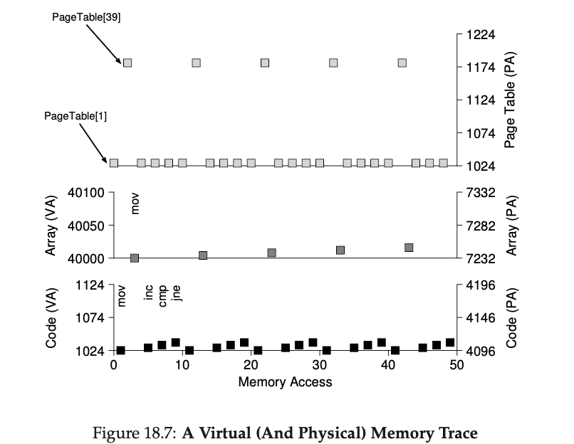
- **Figure 18.7**: Visualizes first 5 iterations
  - Y-axis: Virtual (left) and Physical (right) addresses
  - X-axis: Memory accesses (0–50)
  - Graphs: Code (black, VA 1024–1030, PA 4096–4102), Array (dark gray, VA 40000–40016, PA 7232–7248), Page Table (light gray, PA 1024)

#### End-to-End Memory Access Flowchart
```
[Start: Program Execution (07:35 PM IST, Sep 27, 2025)]
  |
  v
[CPU Fetches First Instruction (VA 1024)]
  |-[Memory Access: Page Table Lookup] (PA 1024 to map VPN 1 → PFN 4)
  |-[Memory Access: Instruction Fetch] (PA 4096)
  |
  v
[Execute Instruction: movl $0x0,(%edi,%eax,4)]
  |-[Compute Array VA (e.g., 40000)]
  |  |-[Memory Access: Page Table Lookup] (PA 1024 to map VPN 39 → PFN 7)
  |  |-[Memory Access: Array Write] (PA 7232)
  |
  v
[Execute Instruction: incl %eax]
  |-[Memory Access: Page Table Lookup] (PA 1024)
  |-[Memory Access: Instruction Fetch] (PA 4100)
  |
  v
[Execute Instruction: cmpl $0x03e8,%eax]
  |-[Memory Access: Page Table Lookup] (PA 1024)
  |-[Memory Access: Instruction Fetch] (PA 4104)
  |
  v
[Execute Instruction: jne 0x1024]
  |-[Memory Access: Page Table Lookup] (PA 1024)
  |-[Memory Access: Instruction Fetch] (PA 4096)
  |
  v
[Condition Check: eax < 1000?]
  |-(Yes)--> [Loop Back to Fetch movl]
  |-(No)----> [End: Program Terminates]
```

#### Key Insights
- Each virtual memory access requires a page table lookup, adding 5 accesses per iteration (4 for instructions, 1 for array write).
- Array accesses start at VPN 39 (PA 7232), crossing to VPN 40+ after index 256 (1KB = 256 integers).
- Unmapped pages (e.g., VPN 0, 2–38) are likely invalid, triggering page faults if accessed.
- The trace reveals complexity, hinting at optimizations like TLBs to reduce page table overhead.

---
## 4. Key Takeaway
- **Page tables live in physical memory**, not inside hardware.
- This design balances practicality (memory size) with OS control.

---

### 5. The Two Main Problems with Paging

Paging's basic implementation introduces two major inefficiencies that must be solved:

1.  **High Time Overhead (Speed):** Every memory access requires **two physical memory accesses** (one for the PTE, one for the data), severely slowing the system down.
2.  **High Space Overhead (Memory):** Large address spaces (e.g., 32-bit) require huge **linear page tables** (e.g., 4MB per process), consuming excessive physical memory.

---
✦━━━━━━━━━━━━━━━✦
   End of Chapter
✦━━━━━━━━━━━━━━━✦
---

# Chapter 19: Paging: Faster Translations (TLBs)
When the CPU generates a virtual address, it must be translated into a physical address to access data in main memory. The naive approach stores the entire page table in main memory. Therefore, for every memory access, the following two memory accesses are required:

    (1) Access the page table in main memory to get the frame number.
    (2) Access the actual data in the main memory frame.
The basic implementation of paging is **prohibitively slow** because **every memory access requires an extra memory lookup** to fetch the translation from the page table. The solution is to use a **hardware cache** called the **Translation-Lookaside Buffer (TLB)**.

---

### 1. The Translation-Lookaside Buffer (TLB)

* **Definition:** A **hardware cache** for popular virtual-to-physical address translations, located inside the **Memory Management Unit (MMU)** on the CPU chip.
* **Goal:** To eliminate the extra memory access required for page table lookups, thus making the common case (a **TLB hit**) fast.
* **Locality:** The TLB relies on **temporal locality** (quickly re-referencing translations) and **spatial locality** (accesses within the same page) for high hit rates.

    With temporal locality, the idea is that an instruction or data item that has been recently accessed will likely be re-accessed soon in the future. Think of loop variables or instructions in a loop; they are accessed repeatedly over time. With spatial locality, the idea is that if a program accesses memory at address x, it will likely soon access memory near x. 

---

### 2. TLB Basic Algorithm

When the CPU generates a Virtual Address (VA):

1.  **TLB Lookup:** The hardware extracts the **VPN** and checks the TLB in parallel.
2.  **TLB Hit (Common Case):**
    * The translation (PFN) is found quickly in the TLB.
    * Hardware checks protection bits.
    * The Physical Address (PA) is formed from the PFN and the Offset.
    * Memory access proceeds with only **one memory reference** (the data/instruction access).
3.  **TLB Miss (Slower Case):**
    * The translation isn't found in the TLB.
    * The hardware or OS must access the **page table in main memory** (incurring the slow, extra memory reference).If the VPN is not found in the TLB (i.e., a TLB miss), the hardware locates the page table in memory (using the **page table base register**) and looks up the page table entry (PTE) for this page using the VPN as an index. If the page is valid and present in physical memory , the hardware extracts the PFN from the PTE, installs it in the TLB, and retries the instruction, this time generating a TLB hit; so far, so good.
    * The translation (PFN, protection bits, etc.) is fetched from the Page Table Entry (PTE).
    * The TLB is updated with the new translation (**TLB Insert**).
    * The instruction is **retried**, which now results in a TLB hit.

    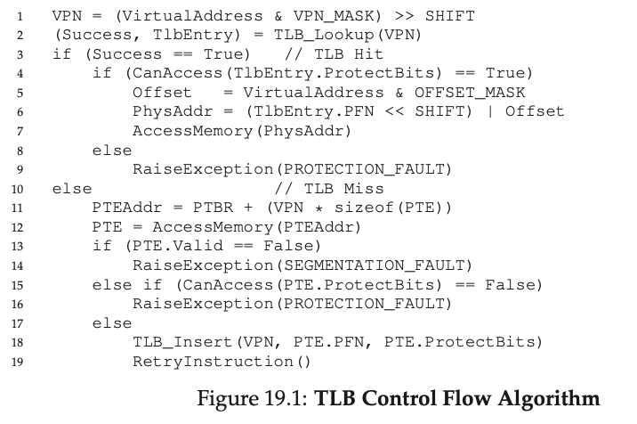

#### Summary of TLB Example: Accessing an Array


##### System Setup
- **Array**: 10 4-byte integers, starting at VA 100.
- **Address Space**: 8-bit (256 bytes), with 16-byte pages (16 VPNs, 4-bit VPN + 4-bit offset).
- **Page Layout**:
    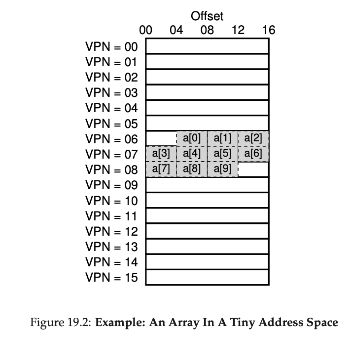
  - a[0]–a[2] on VPN 06 (offset 04–11).
  - a[3]–a[6] on VPN 07.
  - a[7]–a[9] on VPN 08.

##### Program Details
- **C Code**:
  - `int sum = 0; for (i = 0; i < 10; i++) sum += a[i];`
- **Assumption**: Only array accesses are considered (ignoring `i`, `sum`, and instructions).

##### TLB Operation
- **Initial Access (a[0], VA 100, VPN 06)**: TLB miss, page table consulted, TLB updated.
- **a[1]–a[2]**: TLB hits (same page, VPN 06).
- **a[3] (VPN 07)**: TLB miss, page table consulted, TLB updated.
- **a[4]–a[6]**: TLB hits (same page, VPN 07).
- **a[7] (VPN 08)**: TLB miss, page table consulted, TLB updated.
- **a[8]–a[9]**: TLB hits (same page, VPN 08).
- **TLB Activity**: miss, hit, hit, miss, hit, hit, hit, miss, hit, hit.
- **Hit Rate**: 70% (7 hits / 10 accesses).

## Key Insights
- **Spatial Locality**: Elements on the same page (e.g., a[0]–a[2]) result in hits after the first miss, due to close memory placement.
- **Page Size Impact**: A larger page (e.g., 32 bytes) would reduce misses; typical 4KB pages yield near-perfect TLB performance for dense accesses.
- **Temporal Locality**: Re-accessing the array soon after would yield 100% hits if TLB caches all translations.


---

### 3. TLB Control Flow Algorithm (OS Handled)
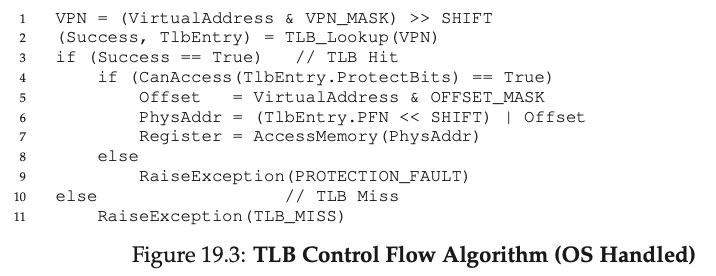
---

### 4. Summary of TLB Miss Handling

| **Aspect**              | **Hardware-Managed TLB (e.g., Intel x86)**       | **Software-Managed TLB (e.g., MIPS R10k, SPARC v9)** |
|--------------------------|-------------------------------------------------|-----------------------------------------------------|
| **Who Handles Miss?**    | Hardware                                        | Operating System (OS)                               |
| **Historical Context**   | Common in older CISC architectures (e.g., x86); hardware designers distrusted OS. | Prevalent in modern RISC architectures; OS trusted to manage. |
| **Mechanism**            | Hardware walks page table using page-table base register (e.g., CR3) to find translation, updates TLB, retries instruction. | Hardware raises exception, OS trap handler looks up translation in page table, updates TLB with privileged instructions, retries instruction. |
| **Page Table Location**  | Fixed format, known to hardware via register.   | Flexible; OS can use any data structure.            |
| **Instruction Retry**    | Hardware automatically retries after TLB update.| OS return-from-trap resumes at faulting instruction; requires saving different PC. |
| **Infinite Miss Risk**   | N/A (handled by hardware).                     | OS must prevent; e.g., keep handlers in physical memory or use wired TLB entries. |
| **Advantages**           | Simplicity for hardware, no OS involvement.    | Flexibility in page table design, simpler hardware (raises exception only). |
| **Disadvantages**        | Rigid page table format, complex hardware.     | Risk of infinite misses if not managed carefully.   |

---

### 5. TLB Contents

A typical TLB entry contains the **VPN**, the corresponding **PFN**, and various **protection bits** (read, write, execute, valid, dirty, accessed).

#### ASIDE: TLB VALID BIT != PAGE TABLE VALID BIT

A common mistake is to confuse the valid bits found in a TLB with those found in a page table. In a page table, when a page-table entry (PTE) is marked invalid, it means that the page has not been allocated by the process, and should not be accessed by a correctly-working program. The usual response when an invalid page is accessed is to trap to the OS, which will respond by killing the process.

A TLB valid bit, in contrast, simply refers to whether a TLB entry has a valid translation within it. When a system boots, for example, a common initial state for each TLB entry is to be set to invalid, because no address translations are yet cached there.

---
### 6. Context Switches

When the OS switches from one process (P1) to another (P2), the cached translations in the TLB are no longer valid for the new process.

| Solution | Mechanism | Overhead/Drawback |
| :--- | :--- | :--- |
| **TLB Flush (Common)** | The OS or hardware sets all valid bits to $\mathbf{0}$ when the **Page-Table Base Register (PTBR)** is changed. | High **overhead on every context switch**, as the TLB must be repopulated (initial misses) for the new process. |
| **Address Space ID (ASID)** | Hardware adds an **ASID** (a small process identifier, e.g., 8 bits for the ASID versus 32 bits for a PID) field to each TLB entry. | Requires extra hardware support and register for the current ASID. |
| **ASID Benefit** | The TLB can simultaneously hold valid translations for multiple processes, eliminating the need for a full flush. |

---

### 7. TLB Replacement Policy

When a new translation needs to be inserted and the TLB is full, an existing entry must be evicted.

* **Goal:** Minimize the TLB miss rate.
* **Policies:**
    * **Least-Recently Used (LRU):** Evicts the entry that hasn't been accessed for the longest time, banking on temporal locality.
    * **Random:** Evicts an entry at random. Useful for avoiding poor performance in specific **corner cases** where LRU fails (e.g., a loop accessing $N$ pages with an $N$-sized TLB).

---

### 9. Real TLB Entry (MIPS R4000)
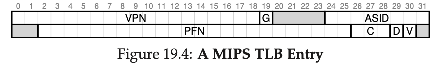
#### System Details
- **Address Space**: 32-bit with 4KB pages.
- **Virtual Address**: 20-bit VPN (19 bits used due to half reserved for kernel) + 12-bit offset.
- **Physical Memory**: Up to 24-bit PFN, supporting 64GB (24 × 4KB pages).

#### TLB Entry Components
- **VPN**: 19 bits (limited by user address space).
- **PFN**: 24 bits (maps to physical frames).
- **Global Bit (G)**: Indicates shared pages, ignoring ASID if set.
- **ASID**: 8-bit Address Space Identifier for process distinction; challenge: what if >256 processes run?
- **Coherence Bits (C)**: 3 bits for cache handling (beyond scope).
- **Dirty Bit**: Marks written pages.
- **Valid Bit**: Indicates valid translation.
- **Page Mask**: Supports multiple page sizes (not shown).
- **Unused Bits**: Some 64 bits shaded gray.

#### TLB Structure
- **Entries**: Typically 32 or 64, with some reserved for OS via a wired register.
- **OS Usage**: Reserves slots for critical code/data (e.g., TLB miss handler) to avoid misses.

#### Management Instructions
- **TLBP**: Probes TLB for a translation.
- **TLBR**: Reads TLB entry into registers.
- **TLBWI**: Replaces specific TLB entry.
- **TLBWR**: Replaces random TLB entry.
- **Privilege**: Instructions are privileged to prevent user misuse (e.g., system takeover).
---

### 10. TLB Coverage

**TLB Coverage** is the total amount of virtual memory that can be simultaneously mapped by the TLB.

$$\text{TLB Coverage} = \text{TLB Entries} \times \text{Page Size}$$

If a program's active working set of pages exceeds the TLB coverage, it suffers frequent TLB misses (violating **Culler's Law**).

* **Mitigation:** Supporting **larger page sizes** (e.g., 2MB or 4MB) allows the TLB to map a much larger amount of memory with the same number of entries, which is crucial for large applications like databases.

#### One other TLB issue worth mentioning: 

TLB access can easily become a bottleneck in the CPU pipeline, in particular with what is called a physically-indexed cache. With such a cache, address translation has to take place before the cache is accessed, which can slow things down quite a bit. Because of this potential problem, people have looked into all sorts of clever ways to access caches with virtual addresses, thus avoiding the expensive step of translation in the case of a cache hit. Such a virtually-indexed cache solves some performance problems, but introduces new issues into hardware design as well. See Wiggins’s fine survey for more details 

---
✦━━━━━━━━━━━━━━━✦
   End of Chapter
✦━━━━━━━━━━━━━━━✦
---

# Chapter 20: Paging: Smaller Tables

The second major problem with basic paging is that **linear page tables are too big**, consuming excessive physical memory (e.g., 4MB per process for a 32-bit AS with 4KB pages). The solution is to use more complex data structures to save space, often at the cost of slower TLB miss handling (a **time-space trade-off**).

---

### 1. Simple Solution: Bigger Pages

A straightforward way to reduce the page table size is to use **larger page sizes** (e.g., 16KB instead of 4KB).

* **Pro:** Reduces the number of Virtual Pages (VPNs) and thus the total number of PTEs, significantly shrinking the page table size (e.g., 4MB $\rightarrow$ 1MB).
* **Con:** Leads to more **internal fragmentation** (unused space inside allocated pages), wasting memory.
* **Modern Systems:** Often support **multiple page sizes** (e.g., 4KB and 4MB) to allow large, active data structures to consume only a single TLB entry (reducing TLB pressure), even if the main reason for smaller pages is the internal fragmentation trade-off.

---

### 2. Hybrid Approach: Paging and Segmentation

This approach combines the two virtualization techniques to exploit the sparsity of an address space.

* **Mechanism:** Instead of one page table for the entire AS, the OS maintains **separate page tables for each logical segment** (e.g., code, heap, stack).
* **Hardware:** The MMU requires a **segment register set** (Base/Bounds) for each segment:
    * **Base Register:** Stores the **physical address of the segment's page table**.
    * **Bounds Register:** Stores the **maximum valid page index** within that segment's page table.
* **Benefit:** Saves memory by **not allocating page table entries for unused space** *between* segments (e.g., the large space between the stack and heap).
* **Drawback:**
    1.  **Flexibility:** Still relies on the segmented view of the AS, which isn't always ideal for sparse but large segments (e.g., a huge, sparse heap).
    2.  **External Fragmentation:** Page tables themselves are now variable-sized, leading to external fragmentation when trying to allocate space for them.

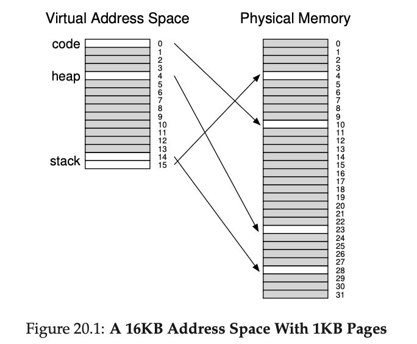
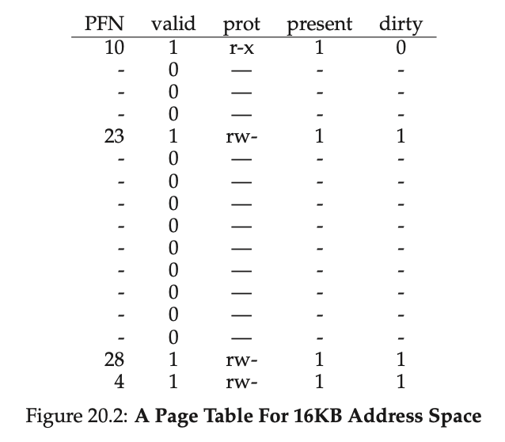

---

### 3. Multi-level Page Tables (The Tree Structure)

This widely-adopted technique eliminates page table waste without relying on segmentation.

#### Basic Idea

The goal is to avoid allocating page table space for invalid regions of the Virtual Address Space (AS).

1.  **Chop the Page Table:** The single linear page table is split into **page-sized units** (chunks).
2.  **Page Directory (PD):** A new top-level structure is introduced. It contains **Page Directory Entries (PDEs)**, one per page-sized chunk of the page table.
3.  **Sparsity:** If an entire chunk of the linear page table contains only invalid entries (i.e., the AS region is unused), the corresponding page-table page is **not allocated** in physical memory, and the PDE for that chunk is marked invalid.

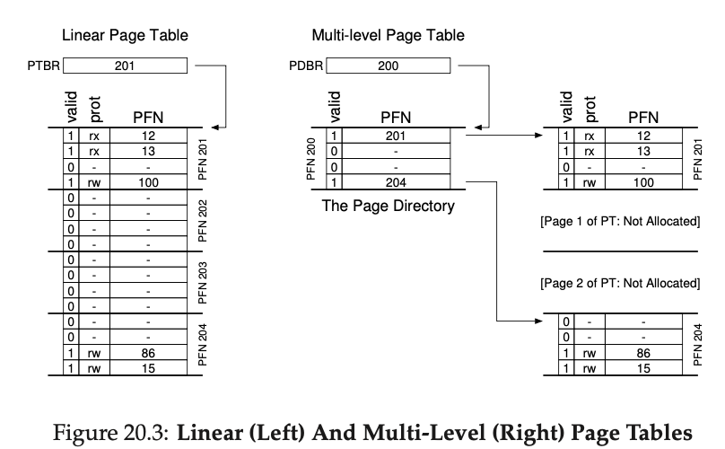

#### Address Translation with Multi-level Tables (Two-Level Example)

The VPN is split further into two indexes:

$$\text{VPN} = \text{Page Directory Index (PDIndex)} + \text{Page Table Index (PTIndex)}$$

1.  **PD Lookup (Memory Access 1):** The hardware uses the **PDIndex** to find the **PDE**. The PDE's PFN points to the physical location of the page-table page.
2.  **PTE Lookup (Memory Access 2):** The hardware uses the **PTIndex** to index into the page-table page found in Step 1 to retrieve the final **PTE** (which contains the required PFN for the data/instruction).

#### Trade-offs

* **Pro (Space Savings):** Significantly reduces memory usage by only allocating page table space for active regions of the AS.
* **Pro (Memory Management):** Allows page table components to be placed anywhere in non-contiguous physical memory, simplifying allocation.
* **Con (Time Cost):** A TLB miss now requires **two or more memory accesses** (one per level of the tree) to retrieve the translation, making miss handling much slower than a single-level table.
* **Con (Complexity):** The lookup logic, whether in hardware or software, is more complicated.
* The multi-level table is a small example of a time-space trade-off. We wanted smaller tables (and got them), but not for free; although in the common case (TLB hit), performance is obviously identical, a TLB miss suffers from a higher cost with this smaller table. 

#### Deepening the Tree

For very large address spaces (e.g., 64-bit), the top-level Page Directory itself might not fit into a single physical page. In such cases, the PD is recursively split, creating a **multi-level page table** with **more than two levels** (e.g., 3 or 4 levels), where the top-level directory points to a second-level directory, which points to the page-table page, and so on.

---

### 4. Inverted Page Tables

This is a memory-saving structure that flips the traditional page table concept.

* **Mechanism:** Instead of a page table per process, the system maintains a **single page table** with one entry for **each physical page frame** of the system.
* **Contents:** Each entry identifies which process is currently using that physical page and which virtual page maps to it.
* **Lookup:** To find a translation, the system must search the table. A **hash table** is often used on top of the structure to speed up lookups (e.g., PowerPC).

---

### 5. Swapping Page Tables to Disk

To handle extreme memory constraints, some systems (e.g., VAX/VMS) allow page tables themselves to be stored in **kernel virtual memory**, enabling the OS to **swap page table pages to disk** when physical memory is tight. This is possible because page tables, like user data, are just data structures in memory.

---

### 6. Single-Level vs Multi-Level Paging (with Example)

#####  Single-Level Paging
- **Idea**: Each process has **one big page table** with one entry per virtual page.
- **Problem**: Wastes memory because even unused regions of the address space need entries.

###### Example (32-bit VA, 4KB page size)
- Virtual address space = $2^{32}$ = 4GB.
- Page size = $2^{12}$ = 4 KB → Number of virtual pages =$ \ \frac{2^{32}}{2^{12}} = 2^{32-12} = 2^{20} = 1 \ million \ pages $
- Each PTE (Page Table Entry) = 4 bytes.
- **Page table size = $2^{20}$ times 4 = 4 MB per process.**

Even if a process uses only 8 MB of memory, it still requires the full **4 MB page table**, with most entries marked invalid.That’s the cost of direct indexing.


#####  Multi-Level Paging
- **Idea**: Page table is split into levels. Only allocate lower-level tables for regions that are actually used.
- **Advantage**: Saves memory for sparse address spaces.

###### Example (2-level, 32-bit VA, 4KB pages)
- 32-bit VA split into:
  - 10 bits: First-level index → 1024 entries.
  - 10 bits: Second-level index → 1024 entries.
  - 12 bits: Page offset.
- Each table has 1024 entries × 4 bytes = 4 KB per table.

If a process uses 8 MB memory:
- Number of pages used = 8 MB/ 4  KB = $2^{11}$ 
- These pages span across 2 second-level tables.
- Memory used:
  - 1 top-level table = 4 KB.
  - 2 second-level tables = 2 × 4 KB = 8 KB.
  - **Total = 12 KB** (instead of 4 MB).


#####  Key Comparison

| Aspect                 | Single-Level Paging       | Multi-Level Paging          |
|------------------------|---------------------------|-----------------------------|
| Page Table Size        | Always 4 MB (for 32-bit) | Depends on usage (few KB–MB) |
| Sparse Address Space   | Very wasteful            | Memory-efficient            |
| Indexing Cost          | 1 memory lookup          | Multiple lookups (slower)   |
| Simplicity             | Simple                   | More complex                |


#####  Takeaway
- **Single-level paging**: Simple but wastes memory (large tables even if mostly unused).
- **Multi-level paging**: Saves memory by allocating tables only for used regions; slight extra lookup overhead.
- In practice, **multi-level paging is preferred** for large virtual address spaces.

---


### 7. Three-Level Page Table Translation

When a page directory itself becomes too large to fit into a single page, we must add another layer of indirection, resulting in a three-level (or more) page table structure.

---

#### **System Specs 🖥️**

Let's assume a hypothetical 32-bit system with the following properties:
* **Virtual Address Size:** 32 bits
* **Page Size:** 1 KB ($2^{10}$ bytes), which means the **offset** is **10 bits**.
* **Page Table Entry (PTE) Size:** 4 bytes.
* **Virtual Page Number (VPN) Size:** $32 - 10 = \textbf{22 bits}$.

A 1 KB page can hold $1024 / 4 = 256$ entries. Therefore, each level of our page table can be indexed using $\log_2(256) = \textbf{8 bits}$. To cover the 22-bit VPN, we must split it into three parts: `6 + 8 + 8`.

This gives us the following virtual address structure:

```

Virtual Address (32 bits)
+--------------+--------------+--------------+---------------+
| PDX0 (6 bits)| PDX1 (8 bits)|  PTX (8 bits)| Offset(10 bits)|
+--------------+--------------+--------------+---------------+

|--------------------------------------------|----------------|
                VPN (22 bits)                      Offset(10 bits)

```
* **PDX0:** Index for the Level 0 Page Directory (the outermost).
* **PDX1:** Index for the Level 1 Page Directory.
* **PTX:** Index for the Level 2 Page Table (the final table).

---

### **Translation Walk-through** 🚶‍♂️

Let's translate the virtual address **`0x12345678`**.

1.  **Binary Representation & Splitting**
    The virtual address in binary is: `0001 0010 0011 0100 0101 0110 0111 1000`

    We split this according to our `6-8-8-10` structure:
    * **PDX0 (6 bits):** `000100` (Decimal: 4)
    * **PDX1 (8 bits):** `10001101` (Decimal: 141)
    * **PTX (8 bits):** `00010101` (Decimal: 21)
    * **Offset (10 bits):** `1001111000` (Decimal: 632 or `0x278`)

    

2.  **The Steps**

    * **Step 1: Access Level 0 Directory (PD0)**
        * The CPU gets the physical base address of the Level 0 directory table from a special register (like `CR3` on x86). Let's say this base address is `0x1000`.
        * It calculates the address of the entry: `Base Address + (PDX0 * PTE Size)` -> `0x1000 + (4 * 4) = 0x1010`.
        * The CPU fetches the 4-byte entry from physical address `0x1010`. This entry contains the **Physical Frame Number (PFN)** of the corresponding Level 1 directory.
        * Let's assume the PFN found is **`0x440`**.

    * **Step 2: Access Level 1 Directory (PD1)**
        * The CPU calculates the base address of the Level 1 directory by taking the PFN from the previous step and shifting it by the page offset bits: `0x440 << 10` -> `0x440000`.
        * It calculates the address of the entry: `Base Address + (PDX1 * PTE Size)` -> `0x440000 + (141 * 4) = 0x440234`.
        * The CPU fetches the entry from physical address `0x440234`. This entry contains the PFN of the final Page Table.
        * Let's assume the PFN found is **`0x9B1`**.

    * **Step 3: Access Level 2 Page Table (PT)**
        * The CPU calculates the base address of the Page Table: `0x9B1 << 10` -> `0x9B1000`.
        * It calculates the address of the final PTE: `Base Address + (PTX * PTE Size)` -> `0x9B1000 + (21 * 4) = 0x9B1054`.
        * The CPU fetches the entry from physical address `0x9B1054`. This PTE contains the PFN of the actual **data page**.
        * Let's assume the final PFN found is **`0xFED`**.

    * **Step 4: Form the Final Physical Address**
        * The CPU now has everything it needs: the PFN of the data page (`0xFED`) and the original offset (`0x278`).
        * It combines them to form the final address: `(PFN << 10) | Offset`.
        * `(0xFED << 10) | 0x278` -> `0xFED000 | 0x278`
        * **Final Physical Address: `0xFED278`**

---

### **Summary Table**

| Step | Index Used | Value (Dec) | Table Base Addr | Entry Address | PFN Result |
| :--- | :--- | :--- | :--- | :--- | :--- |
| 1. L0 Lookup | `PDX0` | 4 | `0x1000` | `0x1010` | `0x440` |
| 2. L1 Lookup | `PDX1` | 141 | `0x440000` | `0x440234` | `0x9B1` |
| 3. L2 Lookup | `PTX` | 21 | `0x9B1000` | `0x9B1054` | `0xFED` |
| **Final** | `Offset` | 632 | - | - | **`0xFED278`** |

This entire process, involving three separate memory lookups, happens only on a **TLB miss**. If the translation is already cached in the TLB, the physical address is generated almost instantly.


---
✦━━━━━━━━━━━━━━━✦
   End of Chapter
✦━━━━━━━━━━━━━━━✦
---

# Chapter 21: Beyond Physical Memory: Mechanisms

Thus far, we’ve assumed that an address space is unrealistically small and fits into physical memory. In fact, we’ve been assuming that every address space of every running process fits into memory. We will now relax these big assumptions, and assume that we wish to support many concurrently-running large address spaces.
   
To support many concurrently running, large address spaces, the OS must provide the illusion of a **Virtual Memory (VM)** size greater than the available **Physical Memory (RAM)**. This requires using a slower, larger level of the memory hierarchy, typically the hard disk drive, a process known as **swapping**.

---

### 1. Swap Space

* **Definition:** A dedicated area on the disk (HDD or SSD) reserved by the OS for storing pages that have been **swapped out** of physical memory.
* **Purpose:**
    * To transparently extend the effective size of physical memory.
    * To support **multiprogramming** by allowing the total memory requirements of all running processes to exceed RAM capacity.
    * **Code Pages:** Code can often be reloaded directly from the original on-disk program binary (file system) rather than swap space, as the binary is the master copy.
* **Mechanism:** The OS must remember the **disk address** (or swap space address) of every page that is currently not in RAM.

---

### 2. The Present Bit and Page Faults

To track whether a page is in memory or on disk, a new field is added to the Page Table Entry (PTE).

* **Present Bit:** A bit in the PTE that indicates:
    * **Present = 1 (True):** The page is currently in physical memory. The PTE's PFN is valid.
    * **Present = 0 (False):** The page is **not** in physical memory; it resides on disk (swap space).
* **Page Fault:** The act of accessing a page that is marked as `Present = 0`.
    * The hardware (or OS, in a software-managed TLB system) checks the PTE.
    * If the access is valid (the page is part of the AS) but the `Present Bit` is false, the hardware raises an **exception** called a `PAGE_FAULT`.

---

### 3. The Page-Fault Handler (OS Software)

All modern systems handle page faults in OS software because I/O operations are so slow that the software overhead is negligible, and it simplifies the hardware design.Virtually all systems handle page faults in software; even with a hardware-managed TLB, the hardware trusts the OS to manage this important duty.

**Steps the OS Page-Fault Handler takes:**

1.  **Find Page Location:** The OS looks in the PTE's PFN field (which is repurposed to hold the **disk address** when the page is not present) to find the page's location in swap space.
2.  **Find Free Frame (If needed):** The OS finds a free physical page frame (**PFN**) in RAM to store the incoming page.
    * If no free frame exists, the OS must run a **page-replacement policy** (EvictPage) to select and kick out an existing page.
3.  **Issue Disk I/O:** The OS issues a **Disk Read** request to fetch the page from swap space into the chosen free physical frame. The process is then set to the **blocked state** while the slow I/O completes.
4.  **Update Structures:** When the I/O finishes, the OS:
    * Updates the PTE: Sets **`Present = True`** and records the new **PFN**.
    * **(Optional/Implicit):** May insert the new translation into the TLB (or rely on the retry step).
5.  **Retry Instruction:** The OS returns control, causing the hardware to **retry the instruction** that caused the page fault. This time, the address translation will result in a **TLB miss** (which fetches the PTE) followed by a **TLB hit** (upon the second retry), allowing the process to continue quickly.

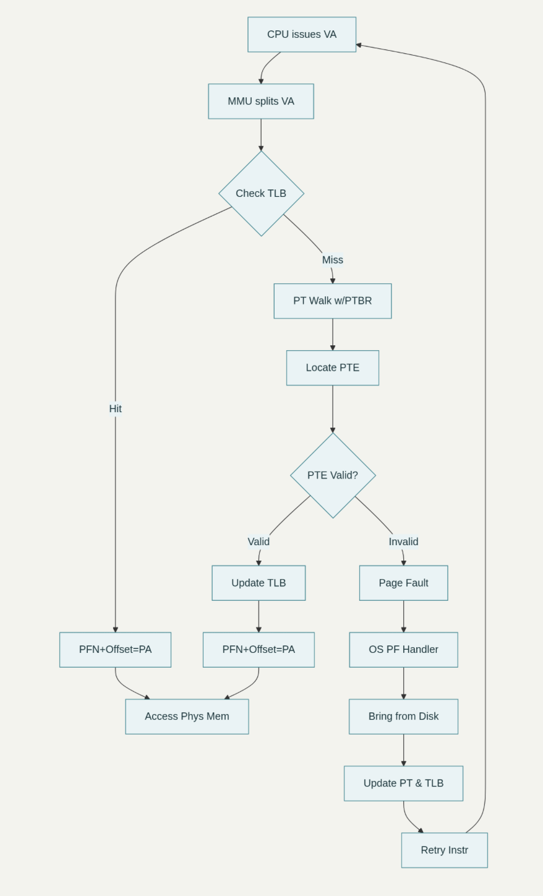
  **Note:** Note that while the I/O is in flight, the process will be in the blocked state. Thus, the OS will be free to run other ready processes while the page fault is being serviced. Because I/O is expensive, this overlap of the I/O (page fault) of one process and the execution of another is yet another way a multiprogrammed system can make the most effective use of its hardware.

---

### 4. Page Fault Control Flow

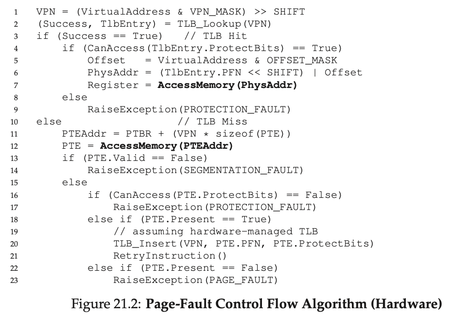

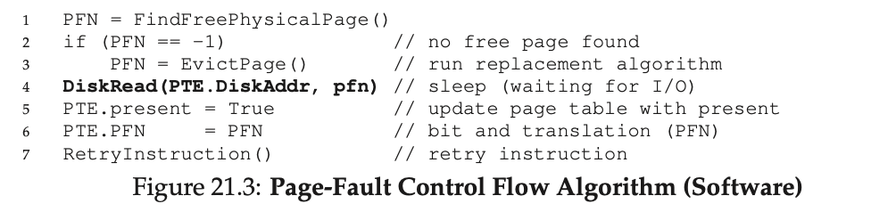
---

### 5. Page Replacement and Watermarks

The process of picking a page to remove from memory (to make room for an incoming page) is called **page replacement**. A poor choice can severely degrade performance.

* **Page-Replacement Policy:** A crucial policy that determines which page is evicted. This will be covered in detail in the next chapter.
* **Proactive Replacement (Watermarks):** OSs generally do not wait until memory is completely full. They use **watermarks** to proactively manage free memory:
    * **Low Watermark ($WL$):** When free pages drop below $WL$, a background thread (the **swap daemon** or **page daemon**) is woken up.
    * **High Watermark ($WH$):** The daemon evicts pages until the number of free pages reaches $WH$.
* **Clustering:** Doing replacements in the background allows the OS to **cluster** multiple page writes to the disk at once, significantly improving disk I/O efficiency (reducing seeks).

To work with the background paging thread, the control flow in Figure 21.3 should be modified slightly; instead of performing a replacement directly, the algorithm would instead simply check if there are any free pages available. If not, it would inform the background paging thread that free pages are needed; when the thread frees up some pages, it would re-awaken the original thread, which could then page in the desired page and go about its work.

#### TIP: DO WORK IN THE BACKGROUND
When you have some work to do, it is often a good idea to do it in the background to increase efficiency and to allow for grouping of operations. Operating systems often do work in the background; for example,many systems buffer file writes in memory before actually writing the data to disk. Doing so has many possible benefits: increased disk efficiency, as the disk may now receive many writes at once and thus better be able to schedule them; improved latency of writes, as the application thinks the writes completed quite quickly; the possibility of work reduction, as the writes may need never to go to disk (i.e., if the file is deleted);and better use of idle time, as the background work may possibly be done when the system is otherwise idle, thus better utilizing the hardware

---
✦━━━━━━━━━━━━━━━✦
   End of Chapter
✦━━━━━━━━━━━━━━━✦
---

# Chapter 22: Beyond Physical Memory: Policies

When physical memory is scarce, the OS must provide a **replacement policy** to decide which existing page to **evict** to make room for a new page. The goal is to minimize future page faults (cache misses) and thus maximize performance.

---

### 1. Cache Management and AMAT

Main memory acts as a **cache** for all virtual memory pages.

* **Goal:** Minimize the **miss rate ($P_{Miss}$)**.
* **Performance Metric:** **Average Memory Access Time (AMAT)**:
    $$\text{AMAT} = (P_{\text{Hit}} \cdot T_M) + (P_{\text{Miss}} \cdot T_D)$$
    * $T_M$ (Memory Access): $\approx 100$ nanoseconds.
    * $T_D$ (Disk Access): $\approx 10$ milliseconds.
    * **Crux:** Since $T_D$ is vastly greater than $T_M$, even a tiny miss rate (e.g., $1\%$) will dominate AMAT, making the program run at disk speeds.

---

### 2. The Optimal Replacement Policy

* **Policy (MIN/Belady's Optimal):** Evict the page that will be accessed **furthest in the future**.
* **Usefulness:** Achieves the fewest possible cache misses but is **impossible to implement** in practice since the future is unknown. It serves as a **benchmark** to evaluate the efficiency of real-world policies.

#### ASIDE: TYPES OF CACHE MISSES
In the computer architecture world, architects sometimes find it useful to characterize misses by type, into one of three categories: compulsory, capacity, and conflict misses, sometimes called the Three C’s [H87]. A compulsory miss (or cold-start miss [EF78]) occurs because the cache is empty to begin with and this is the first reference to the item; in contrast, a capacity miss occurs because the cache ran out of space and had to evict an item to bring a new item into the cache. The third type of miss (a conflict miss) arises in hardware because of limits on where an item can be placed in a hardware cache, due to something known as set-associativity; it does not arise in the OS page cache because such caches are always fully-associative, i.e., there are no restrictions on where in memory a page can be placed. See H&P for details


---

### 3. Simple, Stateless Policies

These are simple to implement but perform poorly because they ignore access history.

* **First-In, First-Out (FIFO):** Evicts the page that has been in memory the **longest**.
    * **Flaw:** May evict a frequently-used (important) page simply because it was loaded early.
    * **Belady's Anomaly:** Increasing the cache size can, counterintuitively, lead to a **decrease** in the hit rate for certain workloads.Some other policies, such as LRU, don’t suffer from this problem. Can you guess why? As it turns out, LRU has what is known as a stack property [M+70]. For algorithms with this property, a cache of size N naturally includes the contents of a cache of size N . Thus, when increasing the cache size, hit rate will either stay the same or improve. FIFO and Random (among others) clearly do not obey the stack property, and thus are susceptible to anomalous behavior.
* **Random:** Evicts a **randomly selected page**.
    * **Pro:** Simple; avoids the pathological corner-cases of FIFO and LRU.

---

### 4. History-Based Policies (Locality)

These policies use the past to predict the future, relying on the **principle of locality** (temporal and spatial).

* **Least-Recently-Used (LRU):** Evicts the page that was used **least recently**.
    * **Principle:** Exploits **temporal locality**; pages recently used are likely to be used again soon.
    * **Performance:** Generally performs much better than FIFO or Random.
* **Least-Frequently-Used (LFU):** Evicts the page that has been used **least frequently**.
* **Implementation Challenge:** Perfect LRU requires recording the access time for every page on **every memory reference**, which is too slow and complex for high-speed systems.

---

### 5. Cache Replacement Policies: Workloads & Implementation

This summary explores how different cache replacement algorithms (**Optimal**, **LRU**, **FIFO**, and **Random**) perform under various workloads and the challenges of implementing them.


#### Workload Performance Analysis

The performance of a replacement policy heavily depends on the memory access patterns of the workload.

##### 1. No Locality Workload
This workload involves accessing a set of unique pages randomly, with no predictable pattern.
* **Finding:** The choice of realistic policy doesn't matter much. **LRU**, **FIFO**, and **Random** perform identically. Their hit rate is directly proportional to the cache size.
* **Optimal:** The Optimal policy (which can see the future) still performs significantly better, highlighting the advantage of foresight.
* **Conclusion:** Without locality, complex historical algorithms offer no benefit over simple ones.

##### 2. 80-20 Workload (with Locality)
This workload exhibits locality, where 80% of memory accesses go to just 20% of the pages (the "hot" pages).
* **Finding:** **LRU** performs noticeably better than FIFO and Random. Because LRU keeps recently used pages, it's more likely to hold onto the "hot" pages that are frequently accessed.
* **Conclusion:** For workloads with locality, LRU is a strong policy. Even a small increase in hit rate is crucial if cache misses are computationally expensive.

##### 3. Looping Sequential Workload 
This workload accesses pages in a sequence and then loops back to the beginning (e.g., 0, 1, 2, ..., 49, 0, 1, ...).
* **Finding:** This is a **worst-case scenario for LRU and FIFO**. They consistently evict the page that will be needed next in the sequence, leading to a near 0% hit rate unless the cache can hold all pages.
* **Interesting Result:** The **Random** policy performs significantly better here. By not following a strict order, it avoids the pathological behavior of LRU/FIFO and manages to keep some useful pages in the cache.


#### Implementation Challenges of LRU 

While LRU often performs well, implementing it perfectly is computationally expensive.

* **The Core Problem:** A perfect LRU implementation must update a data structure on **every single memory access** (instruction fetch, load, or store) to track the most-recently-used page. This constant accounting work can severely degrade system performance.

* **Hardware-Assisted Approach:** One idea is to have hardware automatically update a timestamp for each page upon access. When a page needs to be replaced, the OS could then scan all the timestamps to find the oldest one.

* **The Scalability Issue:** This scanning approach is not practical for modern systems. A machine with millions of pages would require the OS to perform a massive scan just to find one page to evict, which is far too slow.

* **The Solution:** Because a perfect implementation is too costly, systems don't need to find the *absolute* oldest page. Instead, they rely on **LRU approximations**, which provide most of the benefits without the prohibitive performance overhead.

--- 

### 6. Approximating LRU

Real systems use hardware support to approximate LRU's behavior with lower overhead.

* **Hardware Support: The Use Bit (Reference Bit):**
    * A bit associated with each page, set to **1 by hardware** on any access (read or write).
    * The OS is responsible for clearing the bit to **0**.
* **Clock Algorithm:**
    * Pages are arranged in a **circular list** with a "clock hand."
    * On a page fault, the OS checks the page pointed to by the hand:
        * **If Use Bit = 1 (Recently Used):** Clear the bit to 0, advance the hand.
        * **If Use Bit = 0 (Not Recently Used):** Select this page as the **victim** and evict it.

#### Considering Dirty Pages

A common modification is to use the **Modified Bit (Dirty Bit)**, set by hardware when a page is written.

* **Preference:** Clean pages (Modified=0) are preferred for eviction because they don't require an expensive write-back to disk, making the eviction essentially free (no I/O). The Clock Algorithm can be extended to prioritize finding pages that are both **unused and clean**.

---

### 7. Other VM Policies and Thrashing

* **Demand Paging:** The default policy; pages are brought into memory only **"on demand"** when accessed.
* **Prefetching:** Pages are brought in **ahead of time** if the OS predicts they will be used (e.g., sequential access).
* **Clustering/Grouping:** The OS collects multiple pending writes to dirty pages and performs them as a **single, efficient large I/O operation** to disk.
* **Thrashing:** A condition where the system is constantly paging (high miss rate) because the memory demands of all active processes **exceed available RAM**. The system spends all its time servicing page faults.
    * **Mitigation:** **Admission Control** (stopping/not running some processes) or an **Out-of-Memory Killer** (terminating a memory-intensive process).

---

### Summary

The evolution of page replacement policies, such as the Clock algorithm, focuses on an inexpensive approximation of LRU. However, because paging to disk is so incredibly slow, the most practical solution to poor VM performance is often simply **increasing physical memory (RAM)**.

---
✦━━━━━━━━━━━━━━━✦
   End of Chapter
✦━━━━━━━━━━━━━━━✦
---

# Chapter 23: The VAX/VMS Virtual Memory System

This chapter examines the **VAX/VMS** operating system's virtual memory manager to illustrate how the previously discussed mechanisms and policies are integrated into a complete, working system.

---

### 1. Background

* **Hardware:** The **VAX-11 minicomputer** architecture (late 1970s by DEC).
* **OS Designer:** Dave Cutler (later led the development of Windows NT).
* **Challenge (Curse of Generality):** VMS had to run effectively on a huge range of VAX machines, from inexpensive to high-end, necessitating flexible mechanisms and policies. It also had to use software innovations to compensate for hardware flaws.

---

### 2. Memory Management Hardware

The VAX architecture had features that significantly influenced the VMS design:

* **Address Space:** 32-bit virtual address, split into:
    * **23-bit VPN** and **9-bit offset** (meaning pages were only **512 bytes**).
    * **Hybrid Paging/Segmentation:** The top two bits of the address determined the segment.
* **Address Space Regions:**
    * **Process Space (P0 and P1):** Unique to each process. P0 (user code/downward-growing heap) and P1 (upward-growing stack).
    * **System Space (S):** Shared across all processes, containing protected OS code and data.
* **Hardware Flaw and Mitigation:** The **512-byte page size** made linear page tables excessively large. VMS mitigated this using:
    1.  **Segmentation:** Two separate page tables (P0 and P1) per process, eliminating space for the unused gap between the stack and heap.
    2.  **Page Tables in Kernel Virtual Memory:** User page tables (P0 and P1) are allocated within the kernel's own virtual memory (System Space, S). This allows the OS to **swap page table pages to disk** if physical memory pressure becomes severe, freeing up RAM.
* **Address Translation Complexity:** A user address translation might require:
    1.  Looking up the user PTE (in the P0/P1 page table).
    2.  If the user page table page isn't in memory, consulting the system page table (S) to find its location.
    3.  Finally, resolving the address for the desired memory access. This costly, multi-step process is usually avoided by the **hardware-managed TLB**.

---

### 3. A Real Address Space

* **Inaccessible Zero Page:** The first page (VPN 0) is marked inaccessible to help **detect null-pointer dereferences** (virtual address 0), leading to a segmentation fault and process termination.
* **Shared Kernel Space:** The **Kernel's virtual address space (S)** is mapped into every process's address space.
    * **Benefit:** Simplifies kernel code, making it easy to access user pointers (e.g., during system calls) and facilitating page table swapping.
* **Protection:** The hardware uses **protection bits** in the PTE to enforce privilege levels, preventing user code from reading or writing protected OS data/code in the shared System Space.

---

### 4. Page Replacement

VAX hardware did **not include a reference bit**, forcing VMS to devise a policy that works without hardware support for recency.

* **Segmented FIFO:** The policy used to address two problems: the lack of a reference bit and the need to prevent memory hogging.
    * **Mechanism:** Each process has a **Resident Set Size (RSS)** limit. Pages are kept on a per-process **FIFO list**. When a process exceeds its RSS, the oldest page is evicted from its list.
    * **Second Chance:** Evicted pages are **not** immediately written to disk; they are moved to one of two global lists:
        * **Clean-Page Free List:** For unmodified pages.
        * **Dirty-Page List:** For modified pages.
    * **Benefit:** If the original process faults on the page while it's still on a second-chance list, it can be **reclaimed** instantly, avoiding a costly disk I/O. As these lists grow larger, the policy's performance approximates LRU.
* **Page Clustering:** An optimization to combat the inefficiency of small 512-byte pages for disk I/O. VMS groups large batches of dirty pages from the dirty list and writes them to disk in a **single, large, efficient transfer**.

#### ASIDE: EMULATING REFERENCE BITS
As it turns out, you don’t need a hardware reference bit in order to get some notion of which pages are in use in a system. In fact, in the early 1980’s, Babaoglu and Joy showed that protection bits on the VAX can be used to emulate reference bits [BJ81]. The basic idea: if you want to gain some understanding of which pages are actively being used in a system, mark all of the pages in the page table as inaccessible (but keep around the information as to which pages are really accessible by the process,perhaps in the “reserved OS field” portion of the page table entry). When a process accesses a page, it will generate a trap into the OS; the OS will then check if the page really should be accessible, and if so, revert the page to its normal protections (e.g., read-only, or read-write). At the time of a replacement, the OS can check which pages remain marked inaccessible, and thus get an idea of which pages have not been recently used.The key to this “emulation” of reference bits is reducing overhead while still obtaining a good idea of page usage. The OS must not be too aggressive in marking pages inaccessible, or overhead would be too high. The OS also must not be too passive in such marking, or all pages will end up referenced; the OS will again have no good idea which page to evict.

---

### 5. Other Neat VM Tricks

VMS pioneered two lazy optimizations now standard in modern OSs:

* **Demand Zeroing:**
    * **Naive:** On a request to grow the heap, the OS finds a physical page, **zeroes it** (for security), and maps it.
    * **VMS (Lazy):** On a request, the OS only puts an inaccessible entry in the PTE. The physical page is **only allocated and zeroed** the first time the process actually **accesses** the page (on demand). This avoids unnecessary work if the page is never used.
* **Copy-on-Write (COW):**
    * **Goal:** Avoid expensive data copying when two address spaces need to share data, especially during the UNIX `fork()` system call.
    * **Mechanism:** Instead of copying a page, the OS maps the **same physical page** into both address spaces and marks it **read-only**.
    * **Fault:** If either process tries to **write** to the page, a trap occurs. The OS then **lazily allocates a new physical page**, copies the data, and maps the new private page into the faulting process's address space.


---
✦━━━━━━━━━━━━━━━✦
   End of Chapter
✦━━━━━━━━━━━━━━━✦
---

# Chapter 23: Summary Dialogue on Memory Virtualization

**Professor:** Come on, I thought you knew better. You’re trying to learn something here, so that when you go off into the world, you’ll understand how systems actually work.  

**Student:** Hmm... can you give an example?  

**Professor:** Sure! One time back in graduate school, my friends and I were measuring how long memory accesses took, and once in a while the numbers were way higher than we expected; we thought all the data was fitting nicely into the second-level hardware cache, you see, and thus should have been really fast to access.  

**Student:** (nods)  

**Professor:** We couldn’t figure out what was going on. So what do you do in such a case? Easy, ask a professor! So we went and asked one of our professors, who looked at the graph we had produced, and simply said *“TLB”*. Aha! Of course, TLB misses! Why didn’t we think of that? Having a good model of how virtual memory works helps diagnose all sorts of interesting performance problems.  

**Student:** I think I see. I’m trying to build these mental models of how things work, so that when I’m out there working on my own, I won’t be surprised when a system doesn’t quite behave as expected. I should even be able to anticipate how the system will work just by thinking about it.  


---
✦━━━━━━━━━━━━━━━✦
   End of Chapter
✦━━━━━━━━━━━━━━━✦
---